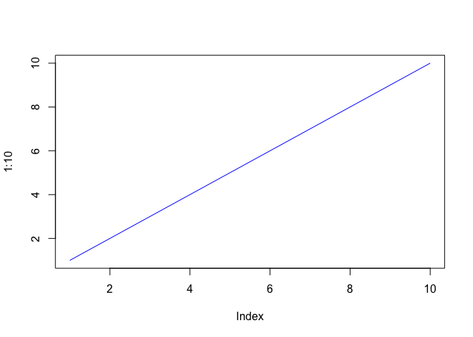
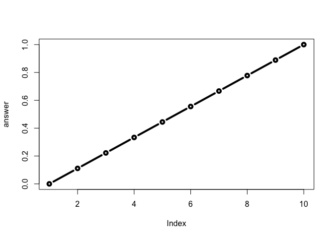

Class 06: R Functions
================
Tiani Louis
4/19/2019

Today we are learning about **R functions** n stuff
---------------------------------------------------

``` r
plot(1:10, typ="l", col="blue")
```



``` r
read.csv("test1.txt", header = T)
```

    ##   Col1 Col2 Col3
    ## 1    1    2    3
    ## 2    4    5    6
    ## 3    7    8    9
    ## 4    a    b    c

``` r
read.table("test2.txt", header = T, sep="$")
```

    ##   Col1 Col2 Col3
    ## 1    1    2    3
    ## 2    4    5    6
    ## 3    7    8    9
    ## 4    a    b    c

``` r
read.table("test3.txt")
```

    ##   V1 V2 V3
    ## 1  1  6  a
    ## 2  2  7  b
    ## 3  3  8  c
    ## 4  4  9  d
    ## 5  5 10  e

We out here tryin' ta FUNCTION
------------------------------

``` r
add <- function(x, y=1) {
 # Sum the input x and y
 x + y
}
```

``` r
add(4, y=5)
```

    ## [1] 9

``` r
add(c(1,3,5))
```

    ## [1] 2 4 6

``` r
add(4)
```

    ## [1] 5

``` r
rescale <- function(x) {
 rng <-range(x)
 (x - rng[1]) / (rng[2] - rng[1])
}
```

``` r
rescale(1:10)
```

    ##  [1] 0.0000000 0.1111111 0.2222222 0.3333333 0.4444444 0.5555556 0.6666667
    ##  [8] 0.7777778 0.8888889 1.0000000

``` r
rescale(c(1, 3, NA, 5, 10))
```

    ## [1] NA NA NA NA NA

``` r
 x <- c(1, 3, NA, 5, 10)
  rng <-range(x, na.rm = T)
  rng
```

    ## [1]  1 10

``` r
 (x - rng[1]) / (rng[2] - rng[1])
```

    ## [1] 0.0000000 0.2222222        NA 0.4444444 1.0000000

``` r
rescale2 <- function(x, na.rm = T) {
 rng <-range(x, na.rm = na.rm)
 (x - rng[1]) / (rng[2] - rng[1])
}

rescale2(x)
```

    ## [1] 0.0000000 0.2222222        NA 0.4444444 1.0000000

``` r
rescale2(c(1, 3, NA, 5, 10))
```

    ## [1] 0.0000000 0.2222222        NA 0.4444444 1.0000000

``` r
rescale3 <- function(x, na.rm=TRUE, plot=FALSE) {
 if(na.rm) {
 rng <-range(x, na.rm=TRUE)
 } else {
 rng <-range(x)
 }
 print("Hello")
 answer <- (x - rng[1]) / (rng[2] - rng[1])

 
 print("is it me you are looking for?")
 if(plot) {
 plot(answer, typ="b", lwd=4)
   print("Don't sing please!!!")

 }
 print("I can see it in ...")
 return(answer)
}
```

``` r
rescale3(1:10)
```

    ## [1] "Hello"
    ## [1] "is it me you are looking for?"
    ## [1] "I can see it in ..."

    ##  [1] 0.0000000 0.1111111 0.2222222 0.3333333 0.4444444 0.5555556 0.6666667
    ##  [8] 0.7777778 0.8888889 1.0000000

``` r
rescale3(1:10, plot = T)
```

    ## [1] "Hello"
    ## [1] "is it me you are looking for?"



    ## [1] "Don't sing please!!!"
    ## [1] "I can see it in ..."

    ##  [1] 0.0000000 0.1111111 0.2222222 0.3333333 0.4444444 0.5555556 0.6666667
    ##  [8] 0.7777778 0.8888889 1.0000000
