Day08
================

``` r
# the code for clustering data using K means clustering is as follows:
# kmenas(x, centers, nstat)
# x = dataframe or numeric matrix
# centers = the amount of clusters that you want 
# nstat = iteration 
```

``` r
# Generate some example data for clustering 
tmp <- c(rnorm(30,-3), rnorm(30,3))
x <- cbind(x=tmp, y=rev(tmp))
plot(x)
```

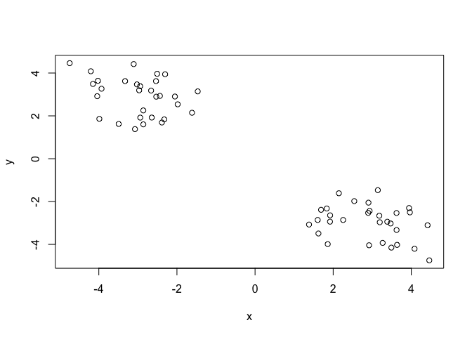<!-- -->

``` r
# Use k means clustering to determine the clusters
km <- kmeans(x, centers = 2, 20)
km
```

    ## K-means clustering with 2 clusters of sizes 30, 30
    ## 
    ## Cluster means:
    ##           x         y
    ## 1 -2.927480  2.859528
    ## 2  2.859528 -2.927480
    ## 
    ## Clustering vector:
    ##  [1] 1 1 1 1 1 1 1 1 1 1 1 1 1 1 1 1 1 1 1 1 1 1 1 1 1 1 1 1 1 1 2 2 2 2 2
    ## [36] 2 2 2 2 2 2 2 2 2 2 2 2 2 2 2 2 2 2 2 2 2 2 2 2 2
    ## 
    ## Within cluster sum of squares by cluster:
    ## [1] 59.33465 59.33465
    ##  (between_SS / total_SS =  89.4 %)
    ## 
    ## Available components:
    ## 
    ## [1] "cluster"      "centers"      "totss"        "withinss"    
    ## [5] "tot.withinss" "betweenss"    "size"         "iter"        
    ## [9] "ifault"

``` r
km$cluster
```

    ##  [1] 1 1 1 1 1 1 1 1 1 1 1 1 1 1 1 1 1 1 1 1 1 1 1 1 1 1 1 1 1 1 2 2 2 2 2
    ## [36] 2 2 2 2 2 2 2 2 2 2 2 2 2 2 2 2 2 2 2 2 2 2 2 2 2

``` r
plot(x, col=km$cluster)
points(km$centers, col="blue", pch=11, cex=3)
```

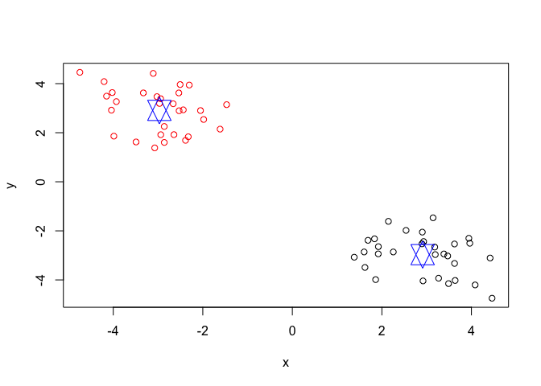<!-- --> Q. How many
points are in each cluster? -30 points Q. What ‘component’ of your
result object details - cluster size? “size” - cluster
assignment/membership? “cluster” - cluster center? “centers” / cluster
means

HIERARCHICAL CLUSTERING For hierarchical clustering, we don’t have to
spell out the number of clusters that we want before hand but we do have
to give it a distance matrix as input

``` r
# First we need to calculate point (dis)similarity
# as the Euclidean distance between observations
dist_matrix <- dist(x)
# The hclust() function returns a hierarchical
# clustering model
hc <- hclust(d = dist_matrix)
# the print method is not so useful here
hc 
```

    ## 
    ## Call:
    ## hclust(d = dist_matrix)
    ## 
    ## Cluster method   : complete 
    ## Distance         : euclidean 
    ## Number of objects: 60

``` r
plot(hc)
abline(h=6, col="red")
```

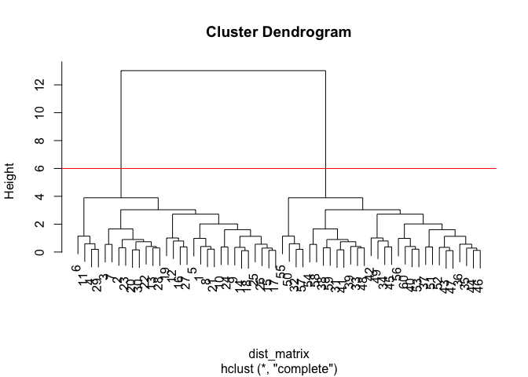<!-- -->

``` r
#cut the tree! at a given height
gp2 <- cutree(hc, k=2)
gp2
```

    ##  [1] 1 1 1 1 1 1 1 1 1 1 1 1 1 1 1 1 1 1 1 1 1 1 1 1 1 1 1 1 1 1 2 2 2 2 2
    ## [36] 2 2 2 2 2 2 2 2 2 2 2 2 2 2 2 2 2 2 2 2 2 2 2 2 2

``` r
table(gp2)
```

    ## gp2
    ##  1  2 
    ## 30 30

``` r
gp3 <- cutree(hc, k=3)
gp3
```

    ##  [1] 1 1 1 1 1 1 1 1 1 1 1 1 1 1 1 1 1 1 1 1 1 1 1 1 1 1 1 1 1 1 2 3 3 2 2
    ## [36] 2 3 3 3 3 2 3 3 2 3 3 3 3 3 3 2 3 2 2 3 3 2 3 3 2

``` r
table(gp3)
```

    ## gp3
    ##  1  2  3 
    ## 30 11 19

``` r
table(gp2, gp3)
```

    ##    gp3
    ## gp2  1  2  3
    ##   1 30  0  0
    ##   2  0 11 19

``` r
# Step 1. Generate some example data for clustering
x <- rbind(
 matrix(rnorm(100, mean=0, sd = 0.3), ncol = 2), # c1
 matrix(rnorm(100, mean = 1, sd = 0.3), ncol = 2), # c2
 matrix(c(rnorm(50, mean = 1, sd = 0.3), # c3
 rnorm(50, mean = 0, sd = 0.3)), ncol = 2))
colnames(x) <- c("x", "y")
# Step 2. Plot the data without clustering
plot(x)
```

<!-- -->

``` r
# Step 3. Generate colors for known clusters
# (just so we can compare to hclust results)
col <- as.factor( rep(c("c1","c2","c3"), each=50) )
plot(x, col=col, pch=11)
```

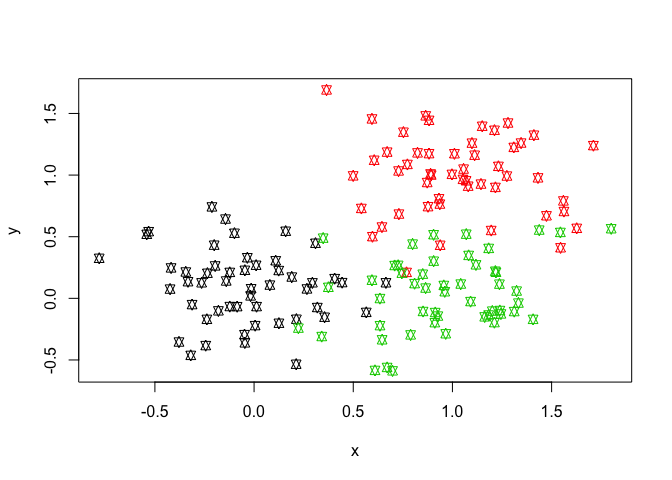<!-- -->

``` r
hc <- hclust(dist(x))
plot(hc, pch=18)
```

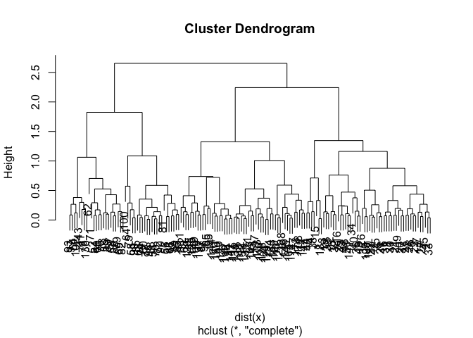<!-- -->

``` r
gp2 <- cutree(hc, k=2)
gp3 <- cutree(hc, k=3)
table(gp2)
```

    ## gp2
    ##   1   2 
    ##  45 105

``` r
table(gp3)
```

    ## gp3
    ##  1  2  3 
    ## 45 53 52

``` r
plot(x, col=gp3)
```

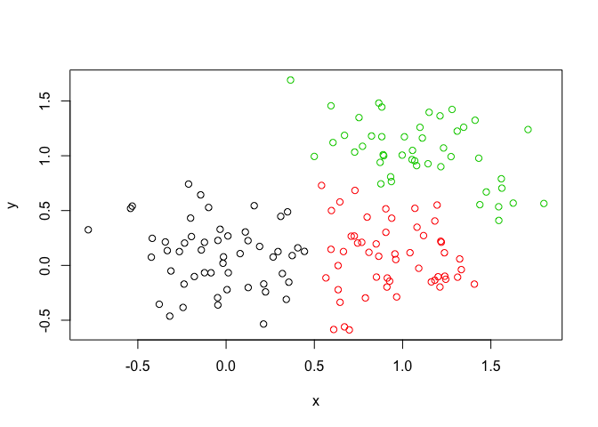<!-- -->

``` r
# prcomp 
mydata <- read.csv("https://tinyurl.com/expression-CSV",row.names=1)
head(mydata)
```

    ##        wt1 wt2  wt3  wt4 wt5 ko1 ko2 ko3 ko4 ko5
    ## gene1  439 458  408  429 420  90  88  86  90  93
    ## gene2  219 200  204  210 187 427 423 434 433 426
    ## gene3 1006 989 1030 1017 973 252 237 238 226 210
    ## gene4  783 792  829  856 760 849 856 835 885 894
    ## gene5  181 249  204  244 225 277 305 272 270 279
    ## gene6  460 502  491  491 493 612 594 577 618 638

``` r
nrow(mydata)
```

    ## [1] 100

There are 100 in this dataset

``` r
# lets do a PCA
pca <- prcomp(t(mydata), scale=TRUE) 
attributes(pca)
```

    ## $names
    ## [1] "sdev"     "rotation" "center"   "scale"    "x"       
    ## 
    ## $class
    ## [1] "prcomp"

``` r
summary(pca)
```

    ## Importance of components:
    ##                           PC1    PC2     PC3     PC4     PC5     PC6
    ## Standard deviation     9.6237 1.5198 1.05787 1.05203 0.88062 0.82545
    ## Proportion of Variance 0.9262 0.0231 0.01119 0.01107 0.00775 0.00681
    ## Cumulative Proportion  0.9262 0.9493 0.96045 0.97152 0.97928 0.98609
    ##                            PC7     PC8     PC9      PC10
    ## Standard deviation     0.80111 0.62065 0.60342 3.348e-15
    ## Proportion of Variance 0.00642 0.00385 0.00364 0.000e+00
    ## Cumulative Proportion  0.99251 0.99636 1.00000 1.000e+00

``` r
pca$x
```

    ##           PC1        PC2        PC3        PC4        PC5        PC6
    ## wt1 -9.697374  1.5233313 -0.2753567  0.7322391 -0.6749398 -1.1823860
    ## wt2 -9.138950  0.3748504  1.0867958 -1.9461655  0.7571209  0.4369228
    ## wt3 -9.054263 -0.9855163  0.4152966  1.4166028  0.5835918 -0.6937236
    ## wt4 -8.731483 -0.7468371  0.5875748  0.2268129 -1.5404775  1.2723618
    ## wt5 -9.006312 -0.2945307 -1.8498101 -0.4303812  0.8666124  0.2496025
    ## ko1  8.846999  2.2345475 -0.1462750 -1.1544333 -0.6947862 -0.7128021
    ## ko2  9.213885 -3.2607503  0.2287292 -0.7658122 -0.4922849 -0.9170241
    ## ko3  9.458412 -0.2636283 -1.5778183  0.2433549  0.3654124  0.5837724
    ## ko4  8.883412  0.6339701  1.5205064  0.7760158  1.2158376  0.1446094
    ## ko5  9.225673  0.7845635  0.0103574  0.9017667 -0.3860869  0.8186668
    ##             PC7         PC8         PC9         PC10
    ## wt1  0.24446614  1.03519396  0.07010231 3.691492e-15
    ## wt2  0.03275370  0.26622249  0.72780448 3.080869e-15
    ## wt3  0.03578383 -1.05851494  0.52979799 2.595146e-15
    ## wt4  0.52795595 -0.20995085 -0.50325679 3.122502e-15
    ## wt5 -0.83227047 -0.05891489 -0.81258430 3.302913e-15
    ## ko1  0.07864392 -0.94652648 -0.24613776 3.351486e-15
    ## ko2 -0.30945771  0.33231138 -0.08786782 2.629841e-15
    ## ko3  1.43723425  0.14495188  0.56617746 3.094747e-15
    ## ko4  0.35073859  0.30381920 -0.87353886 2.983724e-15
    ## ko5 -1.56584821  0.19140827  0.62950330 3.233525e-15

``` r
plot(pca$x[,1], pca$x[,2], pch=19, xlab="PC1", ylab = "PC2") 
```

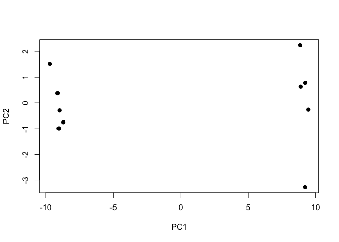<!-- -->

``` r
pca.var <- pca$sdev^2
pca.var.per <- round(pca.var/sum(pca.var)*100, 1) 
pca.var.per
```

    ##  [1] 92.6  2.3  1.1  1.1  0.8  0.7  0.6  0.4  0.4  0.0

``` r
plot(pca.var.per, typ="b")
```

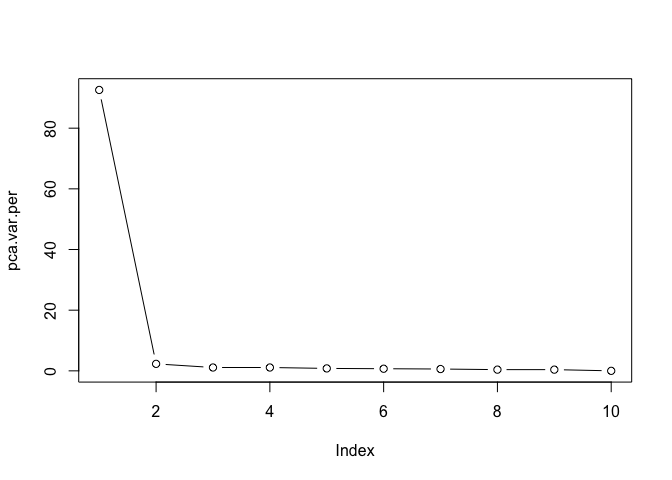<!-- -->

``` r
mycols <- c(rep(col="pink", 5), rep(col="orange", 5))
xlab <- paste("PC1 (", pca.var.per[1], "%)", sep="")
ylab <- paste("PC2 (", pca.var.per[2], "%)", sep="")
plot(pca$x[,1], pca$x[,2], pch=19, xlab=xlab, ylab = ylab, col= mycols) 
```

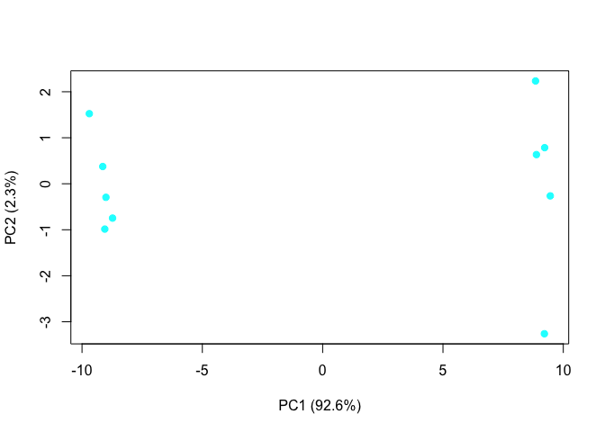<!-- -->

NOW LETS DO SOMETHING ELSE

``` r
 x <- read.csv("UK_foods.csv")
head(x)
```

    ##                X England Wales Scotland N.Ireland
    ## 1         Cheese     105   103      103        66
    ## 2  Carcass_meat      245   227      242       267
    ## 3    Other_meat      685   803      750       586
    ## 4           Fish     147   160      122        93
    ## 5 Fats_and_oils      193   235      184       209
    ## 6         Sugars     156   175      147       139

``` r
# fix the goddamn row names 
# Note how the minus indexing works
x <- read.csv("UK_foods.csv", row.names=1)
head(x)
```

    ##                England Wales Scotland N.Ireland
    ## Cheese             105   103      103        66
    ## Carcass_meat       245   227      242       267
    ## Other_meat         685   803      750       586
    ## Fish               147   160      122        93
    ## Fats_and_oils      193   235      184       209
    ## Sugars             156   175      147       139

``` r
ncol(x)
```

    ## [1] 4

``` r
dim(x)
```

    ## [1] 17  4

``` r
# make a friggin barplot 
# the option beside = F makes the barplot stacked 
barplot(as.matrix(x), beside=F, col=rainbow(nrow(x)))
```

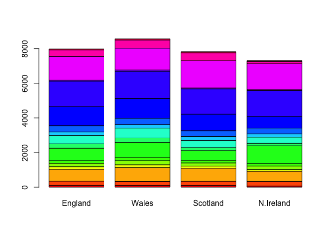<!-- -->

``` r
pairs(x, col=rainbow(10), pch=16)
```

<!-- -->

``` r
plot(pca$x[,1], pca$x[,2], xlab="PC1", ylab="PC2", xlim=c(-270,500), pch=19)
text(pca$x[,1], pca$x[,2], colnames(x), col = mycols)
mycols <- c("orange", "red", "blue", "darkgreen")
abline(v=0, h=0, col="grey")
```

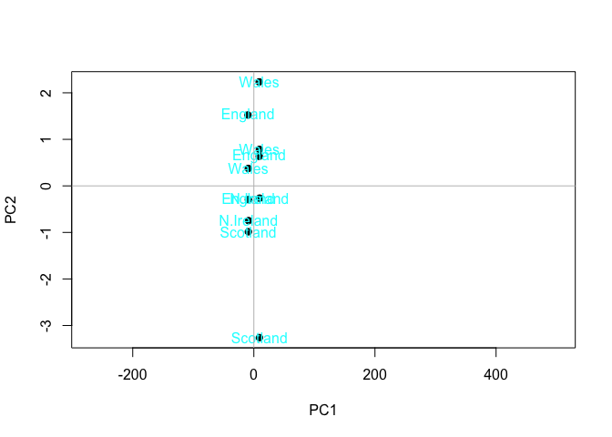<!-- -->

``` r
## Lets focus on PC1 as it accounts for > 90% of variance 
par(mar=c(10, 3, 0.35, 0))
barplot( pca$rotation[,1], las=2 )
```

<!-- -->
