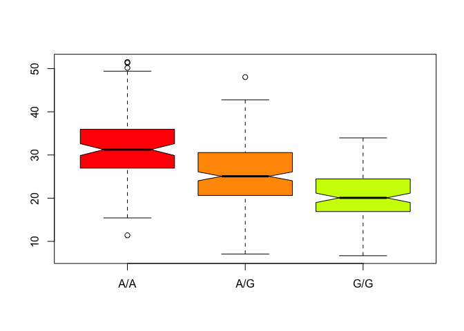

Day 13
================

``` r
data <- read.csv("~/Desktop/SampleGenotypes-Homo_sapiens_Variation_Sample_rs8067378.csv", header = T)
```

``` r
head(data)
```

    ##   Sample..Male.Female.Unknown. Genotype..forward.strand. Population.s.
    ## 1                  NA19648 (F)                       A|A ALL, AMR, MXL
    ## 2                  NA19649 (M)                       G|G ALL, AMR, MXL
    ## 3                  NA19651 (F)                       A|A ALL, AMR, MXL
    ## 4                  NA19652 (M)                       G|G ALL, AMR, MXL
    ## 5                  NA19654 (F)                       G|G ALL, AMR, MXL
    ## 6                  NA19655 (M)                       A|G ALL, AMR, MXL
    ##   Father Mother
    ## 1      -      -
    ## 2      -      -
    ## 3      -      -
    ## 4      -      -
    ## 5      -      -
    ## 6      -      -

``` r
table(data)
```

    ## , , Population.s. = ALL, AMR, MXL, Father = -, Mother = -
    ## 
    ##                             Genotype..forward.strand.
    ## Sample..Male.Female.Unknown. A|A A|G G|A G|G
    ##                  NA19648 (F)   1   0   0   0
    ##                  NA19649 (M)   0   0   0   1
    ##                  NA19651 (F)   1   0   0   0
    ##                  NA19652 (M)   0   0   0   1
    ##                  NA19654 (F)   0   0   0   1
    ##                  NA19655 (M)   0   1   0   0
    ##                  NA19657 (F)   0   1   0   0
    ##                  NA19658 (M)   1   0   0   0
    ##                  NA19661 (M)   0   1   0   0
    ##                  NA19663 (F)   1   0   0   0
    ##                  NA19664 (M)   0   0   1   0
    ##                  NA19669 (F)   1   0   0   0
    ##                  NA19670 (M)   1   0   0   0
    ##                  NA19676 (M)   0   0   0   1
    ##                  NA19678 (F)   1   0   0   0
    ##                  NA19679 (M)   0   1   0   0
    ##                  NA19681 (F)   0   1   0   0
    ##                  NA19682 (M)   0   1   0   0
    ##                  NA19684 (F)   0   1   0   0
    ##                  NA19716 (F)   0   0   1   0
    ##                  NA19717 (M)   0   1   0   0
    ##                  NA19719 (F)   0   0   0   1
    ##                  NA19720 (M)   0   0   0   1
    ##                  NA19722 (F)   0   0   1   0
    ##                  NA19723 (M)   0   0   0   1
    ##                  NA19725 (F)   0   1   0   0
    ##                  NA19726 (M)   1   0   0   0
    ##                  NA19728 (F)   1   0   0   0
    ##                  NA19729 (M)   0   1   0   0
    ##                  NA19731 (F)   1   0   0   0
    ##                  NA19732 (M)   0   1   0   0
    ##                  NA19734 (F)   0   0   1   0
    ##                  NA19735 (M)   0   0   0   1
    ##                  NA19740 (F)   1   0   0   0
    ##                  NA19741 (M)   1   0   0   0
    ##                  NA19746 (F)   1   0   0   0
    ##                  NA19747 (M)   0   0   1   0
    ##                  NA19749 (F)   0   1   0   0
    ##                  NA19750 (M)   0   1   0   0
    ##                  NA19752 (F)   0   1   0   0
    ##                  NA19755 (F)   1   0   0   0
    ##                  NA19756 (M)   0   0   1   0
    ##                  NA19758 (F)   0   1   0   0
    ##                  NA19759 (M)   0   0   1   0
    ##                  NA19761 (F)   0   0   1   0
    ##                  NA19762 (M)   1   0   0   0
    ##                  NA19764 (F)   1   0   0   0
    ##                  NA19770 (F)   0   1   0   0
    ##                  NA19771 (M)   1   0   0   0
    ##                  NA19773 (F)   1   0   0   0
    ##                  NA19774 (M)   0   1   0   0
    ##                  NA19776 (F)   0   1   0   0
    ##                  NA19777 (M)   1   0   0   0
    ##                  NA19779 (F)   0   0   1   0
    ##                  NA19780 (M)   1   0   0   0
    ##                  NA19782 (F)   0   0   1   0
    ##                  NA19783 (M)   0   1   0   0
    ##                  NA19785 (F)   1   0   0   0
    ##                  NA19786 (M)   0   0   1   0
    ##                  NA19788 (F)   0   1   0   0
    ##                  NA19789 (M)   0   0   0   1
    ##                  NA19792 (M)   1   0   0   0
    ##                  NA19794 (F)   0   0   1   0
    ##                  NA19795 (M)   0   1   0   0

``` r
snp.totals <- table(data$Genotype..forward.strand.)
```

``` r
# proportion 
round(table(snp.totals/nrow(data)*100))
```

    ## 
    ## 14.0625   18.75 32.8125  34.375 
    ##       1       1       1       1

``` r
9/64
```

    ## [1] 0.140625

``` r
butt <- read.table("rs8067378_ENSG00000172057.6.txt")
```

``` r
summary(butt)
```

    ##      sample     geno          exp        
    ##  HG00096:  1   A/A:108   Min.   : 6.675  
    ##  HG00097:  1   A/G:233   1st Qu.:20.004  
    ##  HG00099:  1   G/G:121   Median :25.116  
    ##  HG00100:  1             Mean   :25.640  
    ##  HG00101:  1             3rd Qu.:30.779  
    ##  HG00102:  1             Max.   :51.518  
    ##  (Other):456

``` r
# pull out rows that have G/G

inds <- (butt$geno == "G/G")

summary(butt[inds, ]$exp)
```

    ##    Min. 1st Qu.  Median    Mean 3rd Qu.    Max. 
    ##   6.675  16.903  20.074  20.594  24.457  33.956

``` r
hist(butt[inds,]$exp, col= rainbow(10))
```


``` r
boxplot(butt[inds,]$exp, col= rainbow(10))
```


``` r
# Try a boxplot to show this data
# y ~ grp 

boxplot(exp ~ geno, data= butt, notch=T, col=rainbow(10))
#The notches do not overlap, therefore these groups are very likely different 

#ggplots 

library(ggplot2)
```



``` r
ggplot(butt, aes(exp, fill = geno)) + geom_density(alpha = 0.2)
```


``` r
# pull out rows that have A/A

inds <- (butt$geno == "A/A")

summary(butt[inds, ]$exp)
```

    ##    Min. 1st Qu.  Median    Mean 3rd Qu.    Max. 
    ##   11.40   27.02   31.25   31.82   35.92   51.52

``` r
# pull out rows that have A/G

inds <- (butt$geno == "A/G")

summary(butt[inds, ]$exp)
```

    ##    Min. 1st Qu.  Median    Mean 3rd Qu.    Max. 
    ##   7.075  20.626  25.065  25.397  30.552  48.034
