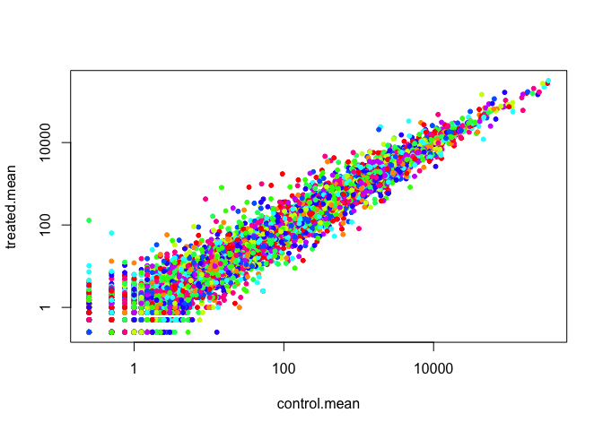
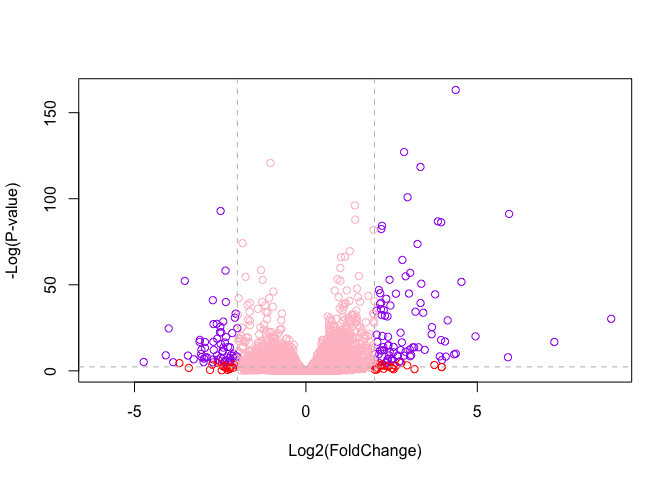

Day 14.1
================

``` r
meta <- read.csv("airway_metadata.csv", stringsAsFactors = F)
counts <- read.csv("airway_scaledcounts.csv", stringsAsFactors = F)

# stringAsFactors = F keeps R from changing the gene names into factors 
```

How many genes are in this
    dataset?

``` r
head(counts)
```

    ##           ensgene SRR1039508 SRR1039509 SRR1039512 SRR1039513 SRR1039516
    ## 1 ENSG00000000003        723        486        904        445       1170
    ## 2 ENSG00000000005          0          0          0          0          0
    ## 3 ENSG00000000419        467        523        616        371        582
    ## 4 ENSG00000000457        347        258        364        237        318
    ## 5 ENSG00000000460         96         81         73         66        118
    ## 6 ENSG00000000938          0          0          1          0          2
    ##   SRR1039517 SRR1039520 SRR1039521
    ## 1       1097        806        604
    ## 2          0          0          0
    ## 3        781        417        509
    ## 4        447        330        324
    ## 5         94        102         74
    ## 6          0          0          0

``` r
nrow(counts)
```

    ## [1] 38694

There are 38,694 genes in the dataset

``` r
head(meta)
```

    ##           id     dex celltype     geo_id
    ## 1 SRR1039508 control   N61311 GSM1275862
    ## 2 SRR1039509 treated   N61311 GSM1275863
    ## 3 SRR1039512 control  N052611 GSM1275866
    ## 4 SRR1039513 treated  N052611 GSM1275867
    ## 5 SRR1039516 control  N080611 GSM1275870
    ## 6 SRR1039517 treated  N080611 GSM1275871

How many control cell lines are in this
dataset?

``` r
#Check if the colnames of "counts" are the same as id column in 'metadata'
colnames(counts)
```

    ## [1] "ensgene"    "SRR1039508" "SRR1039509" "SRR1039512" "SRR1039513"
    ## [6] "SRR1039516" "SRR1039517" "SRR1039520" "SRR1039521"

``` r
meta$id
```

    ## [1] "SRR1039508" "SRR1039509" "SRR1039512" "SRR1039513" "SRR1039516"
    ## [6] "SRR1039517" "SRR1039520" "SRR1039521"

``` r
#remove the first column and check to see if the names are equal in both datasets 
all(colnames(counts)[-1] == meta$id)
```

    ## [1] TRUE

``` r
#'all' checks if they are ALL true. If there is one false it would return FALSE

#now, aswer the question, how many control cell lines are there?

table(meta$dex)
```

    ## 
    ## control treated 
    ##       4       4

Access just the control counts data so we can calculate an average
counts value for each gene in these control samples

``` r
control <- meta[meta[,"dex"]=="control",]
head(control)
```

    ##           id     dex celltype     geo_id
    ## 1 SRR1039508 control   N61311 GSM1275862
    ## 3 SRR1039512 control  N052611 GSM1275866
    ## 5 SRR1039516 control  N080611 GSM1275870
    ## 7 SRR1039520 control  N061011 GSM1275874

Now, we want to get the cols in the counts with these ‘control$id’
colnames

``` r
# calculates the mean value for every row (gene)
control.mean <- rowSums(counts[, control$id]/length(control$id))
head(control.mean)
```

    ## [1] 900.75   0.00 520.50 339.75  97.25   0.75

``` r
# add the names 
names(control.mean) <- counts$ensgene
head(control.mean)
```

    ## ENSG00000000003 ENSG00000000005 ENSG00000000419 ENSG00000000457 
    ##          900.75            0.00          520.50          339.75 
    ## ENSG00000000460 ENSG00000000938 
    ##           97.25            0.75

Now, do the same for the treated samples

``` r
treated <- meta[meta[,"dex"]=="treated",]
head(treated)
```

    ##           id     dex celltype     geo_id
    ## 2 SRR1039509 treated   N61311 GSM1275863
    ## 4 SRR1039513 treated  N052611 GSM1275867
    ## 6 SRR1039517 treated  N080611 GSM1275871
    ## 8 SRR1039521 treated  N061011 GSM1275875

``` r
treated.mean <- rowSums(counts[, treated$id]/length(treated$id))
head(treated.mean)
```

    ## [1] 658.00   0.00 546.00 316.50  78.75   0.00

``` r
names(treated.mean) <- counts$ensgene
head(treated.mean)
```

    ## ENSG00000000003 ENSG00000000005 ENSG00000000419 ENSG00000000457 
    ##          658.00            0.00          546.00          316.50 
    ## ENSG00000000460 ENSG00000000938 
    ##           78.75            0.00

Combine the control and treated data into a single data frame

``` r
mean.counts <- data.frame(treated.mean, control.mean)
head(mean.counts)
```

    ##                 treated.mean control.mean
    ## ENSG00000000003       658.00       900.75
    ## ENSG00000000005         0.00         0.00
    ## ENSG00000000419       546.00       520.50
    ## ENSG00000000457       316.50       339.75
    ## ENSG00000000460        78.75        97.25
    ## ENSG00000000938         0.00         0.75

Now, plot the means of the control and
    treated

``` r
plot(treated.mean ~ control.mean, pch=20, col=rainbow(10), log="xy")
```

    ## Warning in xy.coords(x, y, xlabel, ylabel, log): 15032 x values <= 0
    ## omitted from logarithmic plot

    ## Warning in xy.coords(x, y, xlabel, ylabel, log): 15281 y values <= 0
    ## omitted from logarithmic plot

<!-- -->

``` r
# log = "xy" log transforms the data to spread out the data points 
```

``` r
mean.counts$log2fc <- log2(mean.counts$treated.mean/mean.counts$control.mean)
head(mean.counts)
```

    ##                 treated.mean control.mean      log2fc
    ## ENSG00000000003       658.00       900.75 -0.45303916
    ## ENSG00000000005         0.00         0.00         NaN
    ## ENSG00000000419       546.00       520.50  0.06900279
    ## ENSG00000000457       316.50       339.75 -0.10226805
    ## ENSG00000000460        78.75        97.25 -0.30441833
    ## ENSG00000000938         0.00         0.75        -Inf

NaN is returned when you divide by 0 and try to take the log. The -INf
is returned when you try and take the log of 0.

``` r
#mean.counts[,1:2]==0
to.rm <- unique(which(mean.counts[,1:2]==0, arr.ind=TRUE)[,1])
# remove the counts that are NaN or -Inf
my.counts <- mean.counts[-to.rm, ]
head(my.counts)
```

    ##                 treated.mean control.mean      log2fc
    ## ENSG00000000003       658.00       900.75 -0.45303916
    ## ENSG00000000419       546.00       520.50  0.06900279
    ## ENSG00000000457       316.50       339.75 -0.10226805
    ## ENSG00000000460        78.75        97.25 -0.30441833
    ## ENSG00000000971      6687.50      5219.00  0.35769358
    ## ENSG00000001036      1785.75      2327.00 -0.38194109

``` r
up.inds <- my.counts$log2fc > 2
down.inds <- my.counts$log2fc < (-2)
head(up.inds)
```

    ## [1] FALSE FALSE FALSE FALSE FALSE FALSE

``` r
length(which(up.inds==T))
```

    ## [1] 250

``` r
length(which(down.inds==T))
```

    ## [1] 367

``` r
sum(up.inds)
```

    ## [1] 250

ADD THE ANNODATION DATA\!\!\!\!\!\!\!\!\!\!\!

``` r
anno <- read.csv("annotables_grch38.csv")
head(anno)
```

    ##           ensgene entrez   symbol chr     start       end strand
    ## 1 ENSG00000000003   7105   TSPAN6   X 100627109 100639991     -1
    ## 2 ENSG00000000005  64102     TNMD   X 100584802 100599885      1
    ## 3 ENSG00000000419   8813     DPM1  20  50934867  50958555     -1
    ## 4 ENSG00000000457  57147    SCYL3   1 169849631 169894267     -1
    ## 5 ENSG00000000460  55732 C1orf112   1 169662007 169854080      1
    ## 6 ENSG00000000938   2268      FGR   1  27612064  27635277     -1
    ##          biotype
    ## 1 protein_coding
    ## 2 protein_coding
    ## 3 protein_coding
    ## 4 protein_coding
    ## 5 protein_coding
    ## 6 protein_coding
    ##                                                                                                  description
    ## 1                                                          tetraspanin 6 [Source:HGNC Symbol;Acc:HGNC:11858]
    ## 2                                                            tenomodulin [Source:HGNC Symbol;Acc:HGNC:17757]
    ## 3 dolichyl-phosphate mannosyltransferase polypeptide 1, catalytic subunit [Source:HGNC Symbol;Acc:HGNC:3005]
    ## 4                                               SCY1-like, kinase-like 3 [Source:HGNC Symbol;Acc:HGNC:19285]
    ## 5                                    chromosome 1 open reading frame 112 [Source:HGNC Symbol;Acc:HGNC:25565]
    ## 6                          FGR proto-oncogene, Src family tyrosine kinase [Source:HGNC Symbol;Acc:HGNC:3697]

NOW MERGE THEM\!\!\!\!\!\! USE THE *MERGE* FUNCTION TO COMBINE THE
ANNOTATION DATA WITH THE COUNTS
DATA\!\!\!\!\!\!\!\!\!

``` r
merged.counts <- merge(x=my.counts,  y=anno,  by.x = "row.names", by.y ="ensgene")
head(merged.counts)
```

    ##         Row.names treated.mean control.mean      log2fc entrez   symbol
    ## 1 ENSG00000000003       658.00       900.75 -0.45303916   7105   TSPAN6
    ## 2 ENSG00000000419       546.00       520.50  0.06900279   8813     DPM1
    ## 3 ENSG00000000457       316.50       339.75 -0.10226805  57147    SCYL3
    ## 4 ENSG00000000460        78.75        97.25 -0.30441833  55732 C1orf112
    ## 5 ENSG00000000971      6687.50      5219.00  0.35769358   3075      CFH
    ## 6 ENSG00000001036      1785.75      2327.00 -0.38194109   2519    FUCA2
    ##   chr     start       end strand        biotype
    ## 1   X 100627109 100639991     -1 protein_coding
    ## 2  20  50934867  50958555     -1 protein_coding
    ## 3   1 169849631 169894267     -1 protein_coding
    ## 4   1 169662007 169854080      1 protein_coding
    ## 5   1 196651878 196747504      1 protein_coding
    ## 6   6 143494811 143511690     -1 protein_coding
    ##                                                                                                  description
    ## 1                                                          tetraspanin 6 [Source:HGNC Symbol;Acc:HGNC:11858]
    ## 2 dolichyl-phosphate mannosyltransferase polypeptide 1, catalytic subunit [Source:HGNC Symbol;Acc:HGNC:3005]
    ## 3                                               SCY1-like, kinase-like 3 [Source:HGNC Symbol;Acc:HGNC:19285]
    ## 4                                    chromosome 1 open reading frame 112 [Source:HGNC Symbol;Acc:HGNC:25565]
    ## 5                                                     complement factor H [Source:HGNC Symbol;Acc:HGNC:4883]
    ## 6                                          fucosidase, alpha-L- 2, plasma [Source:HGNC Symbol;Acc:HGNC:4008]

``` r
library("AnnotationDbi")
library("org.Hs.eg.db")
```

    ## 

``` r
my.counts$entrez <- mapIds(org.Hs.eg.db,
                     keys=row.names(my.counts), # Our genenames
                     keytype="ENSEMBL",        # The format of our genenames
                     column="ENTREZID",          # The new format we want to add
                     multiVals="first")
```

    ## 'select()' returned 1:many mapping between keys and columns

``` r
head(my.counts)
```

    ##                 treated.mean control.mean      log2fc entrez
    ## ENSG00000000003       658.00       900.75 -0.45303916   7105
    ## ENSG00000000419       546.00       520.50  0.06900279   8813
    ## ENSG00000000457       316.50       339.75 -0.10226805  57147
    ## ENSG00000000460        78.75        97.25 -0.30441833  55732
    ## ENSG00000000971      6687.50      5219.00  0.35769358   3075
    ## ENSG00000001036      1785.75      2327.00 -0.38194109   2519

``` r
my.counts$uniprot <- mapIds(org.Hs.eg.db,
                     keys=row.names(my.counts), # Our genenames
                     keytype="ENSEMBL",        # The format of our genenames
                     column="UNIPROT",          # The new format we want to add
                     multiVals="first")
```

    ## 'select()' returned 1:many mapping between keys and columns

``` r
head(my.counts)
```

    ##                 treated.mean control.mean      log2fc entrez    uniprot
    ## ENSG00000000003       658.00       900.75 -0.45303916   7105 A0A024RCI0
    ## ENSG00000000419       546.00       520.50  0.06900279   8813     O60762
    ## ENSG00000000457       316.50       339.75 -0.10226805  57147     Q8IZE3
    ## ENSG00000000460        78.75        97.25 -0.30441833  55732 A0A024R922
    ## ENSG00000000971      6687.50      5219.00  0.35769358   3075 A0A024R962
    ## ENSG00000001036      1785.75      2327.00 -0.38194109   2519     Q9BTY2

``` r
#citation("DESeq2")
```

Build a DESeq2 Dataset object needed for running Deseq analysis

``` r
dds <- DESeqDataSetFromMatrix(countData=counts, 
                              colData=meta, 
                              design=~dex, 
                              tidy=TRUE)
```

    ## converting counts to integer mode

    ## Warning in DESeqDataSet(se, design = design, ignoreRank): some variables in
    ## design formula are characters, converting to factors

``` r
dds <- DESeq(dds)
```

    ## estimating size factors

    ## estimating dispersions

    ## gene-wise dispersion estimates

    ## mean-dispersion relationship

    ## final dispersion estimates

    ## fitting model and testing

``` r
res <- results(dds)
head(as.data.frame(res))
```

    ##                    baseMean log2FoldChange     lfcSE       stat     pvalue
    ## ENSG00000000003 747.1941954    -0.35070302 0.1682457 -2.0844697 0.03711747
    ## ENSG00000000005   0.0000000             NA        NA         NA         NA
    ## ENSG00000000419 520.1341601     0.20610777 0.1010592  2.0394752 0.04140263
    ## ENSG00000000457 322.6648439     0.02452695 0.1451451  0.1689823 0.86581056
    ## ENSG00000000460  87.6826252    -0.14714205 0.2570073 -0.5725210 0.56696907
    ## ENSG00000000938   0.3191666    -1.73228897 3.4936010 -0.4958463 0.62000288
    ##                      padj
    ## ENSG00000000003 0.1630348
    ## ENSG00000000005        NA
    ## ENSG00000000419 0.1760317
    ## ENSG00000000457 0.9616942
    ## ENSG00000000460 0.8158486
    ## ENSG00000000938        NA

``` r
summary(res)
```

    ## 
    ## out of 25258 with nonzero total read count
    ## adjusted p-value < 0.1
    ## LFC > 0 (up)       : 1563, 6.2%
    ## LFC < 0 (down)     : 1188, 4.7%
    ## outliers [1]       : 142, 0.56%
    ## low counts [2]     : 9971, 39%
    ## (mean count < 10)
    ## [1] see 'cooksCutoff' argument of ?results
    ## [2] see 'independentFiltering' argument of ?results

``` r
res05 <- results(dds, alpha=0.05)
summary(res05)
```

    ## 
    ## out of 25258 with nonzero total read count
    ## adjusted p-value < 0.05
    ## LFC > 0 (up)       : 1236, 4.9%
    ## LFC < 0 (down)     : 933, 3.7%
    ## outliers [1]       : 142, 0.56%
    ## low counts [2]     : 9033, 36%
    ## (mean count < 6)
    ## [1] see 'cooksCutoff' argument of ?results
    ## [2] see 'independentFiltering' argument of ?results

``` r
# Setup our custom point color vector 
mycols <- rep("pink", nrow(res))
mycols[ abs(res$log2FoldChange) > 2 ]  <- "red" 

inds <- (res$padj < 0.01) & (abs(res$log2FoldChange) > 2 )
mycols[ inds ] <- "purple"

# Volcano plot with custom colors 
plot( res$log2FoldChange,  -log(res$padj), 
 col=mycols, ylab="-Log(P-value)", xlab="Log2(FoldChange)" )

# Cut-off lines
abline(v=c(-2,2), col="gray", lty=2)
abline(h=-log(0.1), col="gray", lty=2)
```

<!-- -->

``` r
x <- as.data.frame(res)
x$symbol <- mapIds(org.Hs.eg.db, 
                   keys=row.names(x),
                   keytype="ENSEMBL",
                   column="SYMBOL",
                   multiVals="first")
```

    ## 'select()' returned 1:many mapping between keys and columns

``` r
head(x)
```

    ##                    baseMean log2FoldChange     lfcSE       stat     pvalue
    ## ENSG00000000003 747.1941954    -0.35070302 0.1682457 -2.0844697 0.03711747
    ## ENSG00000000005   0.0000000             NA        NA         NA         NA
    ## ENSG00000000419 520.1341601     0.20610777 0.1010592  2.0394752 0.04140263
    ## ENSG00000000457 322.6648439     0.02452695 0.1451451  0.1689823 0.86581056
    ## ENSG00000000460  87.6826252    -0.14714205 0.2570073 -0.5725210 0.56696907
    ## ENSG00000000938   0.3191666    -1.73228897 3.4936010 -0.4958463 0.62000288
    ##                      padj   symbol
    ## ENSG00000000003 0.1630348   TSPAN6
    ## ENSG00000000005        NA     TNMD
    ## ENSG00000000419 0.1760317     DPM1
    ## ENSG00000000457 0.9616942    SCYL3
    ## ENSG00000000460 0.8158486 C1orf112
    ## ENSG00000000938        NA      FGR

``` r
library(EnhancedVolcano)
```

    ## Loading required package: ggplot2

    ## Loading required package: ggrepel

``` r
library(ggplot2)
library(ggrepel)
```

``` r
EnhancedVolcano(x,
    lab = x$symbol,
    x = 'log2FoldChange',
    y = 'pvalue')
```

    ## Warning: Removed 13578 rows containing missing values (geom_point).

    ## Warning: Removed 24 rows containing missing values (geom_text).

<!-- -->
