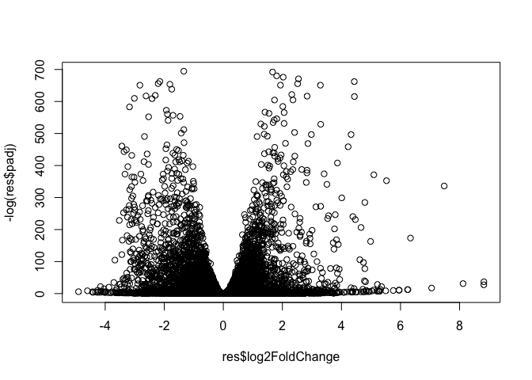
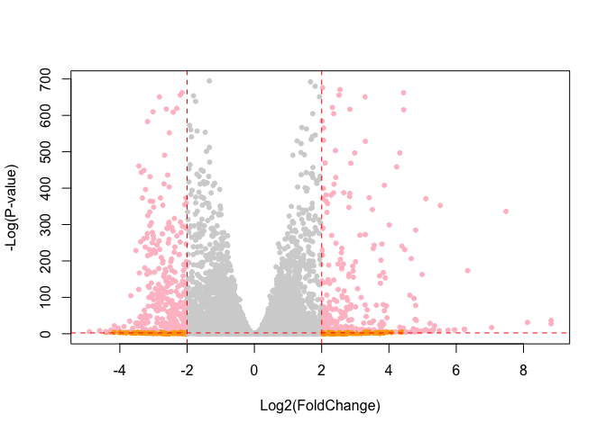
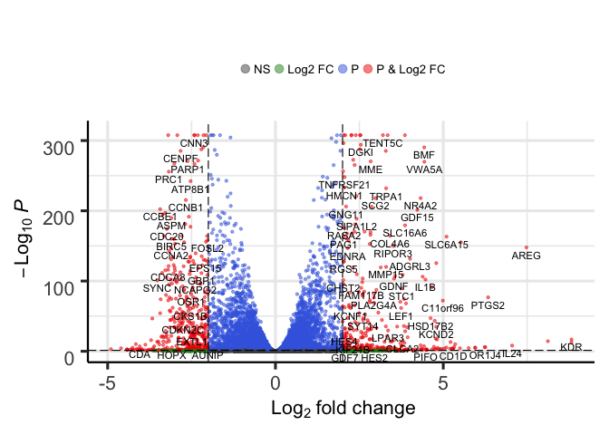

Day 15: Pathway Analysis from RNA-Seq Results
================

``` r
#load in data
colData <- read.csv("GSE37704_metadata.csv", row.names=1)

countData <- read.csv("GSE37704_featurecounts.csv", row.names=1)
```

``` r
# take a peak
head(colData)
```

    ##               condition
    ## SRR493366 control_sirna
    ## SRR493367 control_sirna
    ## SRR493368 control_sirna
    ## SRR493369      hoxa1_kd
    ## SRR493370      hoxa1_kd
    ## SRR493371      hoxa1_kd

``` r
head(countData)
```

    ##                 length SRR493366 SRR493367 SRR493368 SRR493369 SRR493370
    ## ENSG00000186092    918         0         0         0         0         0
    ## ENSG00000279928    718         0         0         0         0         0
    ## ENSG00000279457   1982        23        28        29        29        28
    ## ENSG00000278566    939         0         0         0         0         0
    ## ENSG00000273547    939         0         0         0         0         0
    ## ENSG00000187634   3214       124       123       205       207       212
    ##                 SRR493371
    ## ENSG00000186092         0
    ## ENSG00000279928         0
    ## ENSG00000279457        46
    ## ENSG00000278566         0
    ## ENSG00000273547         0
    ## ENSG00000187634       258

``` r
countData <- as.matrix(countData[,-1])
head(countData)
```

    ##                 SRR493366 SRR493367 SRR493368 SRR493369 SRR493370
    ## ENSG00000186092         0         0         0         0         0
    ## ENSG00000279928         0         0         0         0         0
    ## ENSG00000279457        23        28        29        29        28
    ## ENSG00000278566         0         0         0         0         0
    ## ENSG00000273547         0         0         0         0         0
    ## ENSG00000187634       124       123       205       207       212
    ##                 SRR493371
    ## ENSG00000186092         0
    ## ENSG00000279928         0
    ## ENSG00000279457        46
    ## ENSG00000278566         0
    ## ENSG00000273547         0
    ## ENSG00000187634       258

``` r
# Filter count data where you have 0 read count across all samples.
countData <- countData[which(rowSums(countData) > 0),]
head(countData)
```

    ##                 SRR493366 SRR493367 SRR493368 SRR493369 SRR493370
    ## ENSG00000279457        23        28        29        29        28
    ## ENSG00000187634       124       123       205       207       212
    ## ENSG00000188976      1637      1831      2383      1226      1326
    ## ENSG00000187961       120       153       180       236       255
    ## ENSG00000187583        24        48        65        44        48
    ## ENSG00000187642         4         9        16        14        16
    ##                 SRR493371
    ## ENSG00000279457        46
    ## ENSG00000187634       258
    ## ENSG00000188976      1504
    ## ENSG00000187961       357
    ## ENSG00000187583        64
    ## ENSG00000187642        16

``` r
nrow(countData)
```

    ## [1] 15975

``` r
# Nice now lets setup the DESeqDataSet object required for the DESeq() function and then run the DESeq pipeline. This is again similar to our last days hands-on session.
dds = DESeqDataSetFromMatrix(countData = countData, 
                             colData = colData,
                             design = ~condition)
dds = DESeq(dds)
```

    ## estimating size factors

    ## estimating dispersions

    ## gene-wise dispersion estimates

    ## mean-dispersion relationship

    ## final dispersion estimates

    ## fitting model and testing

``` r
dds
```

    ## class: DESeqDataSet 
    ## dim: 15975 6 
    ## metadata(1): version
    ## assays(4): counts mu H cooks
    ## rownames(15975): ENSG00000279457 ENSG00000187634 ...
    ##   ENSG00000276345 ENSG00000271254
    ## rowData names(22): baseMean baseVar ... deviance maxCooks
    ## colnames(6): SRR493366 SRR493367 ... SRR493370 SRR493371
    ## colData names(2): condition sizeFactor

Next, get results for the HoxA1 knockdown versus control siRNA (remember that these were labeled as "hoxa1\_kd" and "control\_sirna" in our original colData metaFile input to DESeq, you can check this above and by running resultsNames(dds) command).

``` r
res = results(dds)
resultsNames(dds)
```

    ## [1] "Intercept"                          
    ## [2] "condition_hoxa1_kd_vs_control_sirna"

``` r
summary(res)
```

    ## 
    ## out of 15975 with nonzero total read count
    ## adjusted p-value < 0.1
    ## LFC > 0 (up)       : 4349, 27%
    ## LFC < 0 (down)     : 4396, 28%
    ## outliers [1]       : 0, 0%
    ## low counts [2]     : 1237, 7.7%
    ## (mean count < 0)
    ## [1] see 'cooksCutoff' argument of ?results
    ## [2] see 'independentFiltering' argument of ?results

VOLCANO PLOT!!!!! Now we will make a volcano plot, a commonly produced visualization from this type of data that we introduced last day. Basically it's a plot of log2 fold change vs -log adjusted p-value.

``` r
plot(res$log2FoldChange, -log(res$padj) )
```

 color by up/down regulated genes

``` r
# Make a color vector for all genes
mycols <- rep("light grey", nrow(res))
# Color red the genes with absolute fold change above 2
mycols[ abs(res$log2FoldChange) > 2 ] <- "orange"

# Color blue those with adjusted p-value less than 0.01
#  and absolute fold change more than 2
inds <- (abs(res$padj) < 0.01) & (abs(res$log2FoldChange) > 2 )
mycols[ inds ] <- "pink"

plot( res$log2FoldChange, -log(res$padj), col= mycols, xlab="Log2(FoldChange)", ylab="-Log(P-value)", pch=20)

abline(v=c(-2,2), col="red", lty=2)
abline(h=-log(0.1), col="red", lty=2)
```



``` r
library("AnnotationDbi")
library("org.Hs.eg.db")

columns(org.Hs.eg.db)
```

    ##  [1] "ACCNUM"       "ALIAS"        "ENSEMBL"      "ENSEMBLPROT" 
    ##  [5] "ENSEMBLTRANS" "ENTREZID"     "ENZYME"       "EVIDENCE"    
    ##  [9] "EVIDENCEALL"  "GENENAME"     "GO"           "GOALL"       
    ## [13] "IPI"          "MAP"          "OMIM"         "ONTOLOGY"    
    ## [17] "ONTOLOGYALL"  "PATH"         "PFAM"         "PMID"        
    ## [21] "PROSITE"      "REFSEQ"       "SYMBOL"       "UCSCKG"      
    ## [25] "UNIGENE"      "UNIPROT"

``` r
x <- as.data.frame(res) 
x$symbol <- mapIds(org.Hs.eg.db, 
                   keys=row.names(x),  ## 1. annotation dataset   ## 5. What to do for multiple matches 
                   keytype="ENSEMBL",  ## 2. our exisiting IDS
                   column="SYMBOL",    ## 3. Format of our IDS
                   multiVals="first")  ## 4. The format we want
```

    ## 'select()' returned 1:many mapping between keys and columns

``` r
x$entrez = mapIds(org.Hs.eg.db,
                    keys=row.names(x),
                    keytype="ENSEMBL",
                    column="ENTREZID",
                    multiVals="first")
```

    ## 'select()' returned 1:many mapping between keys and columns

``` r
x$name =   mapIds(org.Hs.eg.db,
                    keys=row.names(x),
                  keytype="ENSEMBL",
                    column="GENENAME",
                    multiVals="first")
```

    ## 'select()' returned 1:many mapping between keys and columns

``` r
head(x, 10)
```

    ##                     baseMean log2FoldChange      lfcSE        stat
    ## ENSG00000279457   29.9135794     0.17925708 0.32482157   0.5518632
    ## ENSG00000187634  183.2296499     0.42645712 0.14026582   3.0403495
    ## ENSG00000188976 1651.1880762    -0.69272046 0.05484654 -12.6301576
    ## ENSG00000187961  209.6379385     0.72975561 0.13185990   5.5343255
    ## ENSG00000187583   47.2551233     0.04057653 0.27189281   0.1492372
    ## ENSG00000187642   11.9797502     0.54281049 0.52155985   1.0407444
    ## ENSG00000188290  108.9221280     2.05706383 0.19690531  10.4469697
    ## ENSG00000187608  350.7168680     0.25738369 0.10272656   2.5055223
    ## ENSG00000188157 9128.4394220     0.38990879 0.04671634   8.3463044
    ## ENSG00000237330    0.1581924     0.78595521 4.08047286   0.1926138
    ##                       pvalue         padj  symbol    entrez
    ## ENSG00000279457 5.810421e-01 6.865548e-01  WASH9P 102723897
    ## ENSG00000187634 2.363037e-03 5.157181e-03  SAMD11    148398
    ## ENSG00000188976 1.439895e-36 1.765489e-35   NOC2L     26155
    ## ENSG00000187961 3.124282e-08 1.134130e-07  KLHL17    339451
    ## ENSG00000187583 8.813664e-01 9.190306e-01 PLEKHN1     84069
    ## ENSG00000187642 2.979942e-01 4.033793e-01   PERM1     84808
    ## ENSG00000188290 1.512819e-25 1.305382e-24    HES4     57801
    ## ENSG00000187608 1.222707e-02 2.374523e-02   ISG15      9636
    ## ENSG00000188157 7.043211e-17 4.219628e-16    AGRN    375790
    ## ENSG00000237330 8.472615e-01           NA  RNF223    401934
    ##                                                                     name
    ## ENSG00000279457                 WAS protein family homolog 9, pseudogene
    ## ENSG00000187634                 sterile alpha motif domain containing 11
    ## ENSG00000188976 NOC2 like nucleolar associated transcriptional repressor
    ## ENSG00000187961                              kelch like family member 17
    ## ENSG00000187583                 pleckstrin homology domain containing N1
    ## ENSG00000187642             PPARGC1 and ESRR induced regulator, muscle 1
    ## ENSG00000188290                   hes family bHLH transcription factor 4
    ## ENSG00000187608                            ISG15 ubiquitin-like modifier
    ## ENSG00000188157                                                    agrin
    ## ENSG00000237330                                  ring finger protein 223

``` r
EnhancedVolcano(x,
    lab = x$symbol,
    x = 'log2FoldChange',
    y = 'pvalue')
```

    ## Warning: One or more P values is 0. Converting to minimum possible value...

    ## Warning: Removed 2 rows containing missing values (geom_text).



``` r
res = res[order(res$pvalue),]
write.csv(x, file ="deseq_results.csv")
```

``` r
library("pathview")
```

    ## ##############################################################################
    ## Pathview is an open source software package distributed under GNU General
    ## Public License version 3 (GPLv3). Details of GPLv3 is available at
    ## http://www.gnu.org/licenses/gpl-3.0.html. Particullary, users are required to
    ## formally cite the original Pathview paper (not just mention it) in publications
    ## or products. For details, do citation("pathview") within R.
    ## 
    ## The pathview downloads and uses KEGG data. Non-academic uses may require a KEGG
    ## license agreement (details at http://www.kegg.jp/kegg/legal.html).
    ## ##############################################################################

``` r
library("gage")
library(gageData)
```

``` r
data(kegg.sets.hs)
data(sigmet.idx.hs)

# Focus on signaling and metabolic pathways only
kegg.sets.hs = kegg.sets.hs[sigmet.idx.hs]

# Examine the first 3 pathways
head(kegg.sets.hs, 3)
```

    ## $`hsa00232 Caffeine metabolism`
    ## [1] "10"   "1544" "1548" "1549" "1553" "7498" "9"   
    ## 
    ## $`hsa00983 Drug metabolism - other enzymes`
    ##  [1] "10"     "1066"   "10720"  "10941"  "151531" "1548"   "1549"  
    ##  [8] "1551"   "1553"   "1576"   "1577"   "1806"   "1807"   "1890"  
    ## [15] "221223" "2990"   "3251"   "3614"   "3615"   "3704"   "51733" 
    ## [22] "54490"  "54575"  "54576"  "54577"  "54578"  "54579"  "54600" 
    ## [29] "54657"  "54658"  "54659"  "54963"  "574537" "64816"  "7083"  
    ## [36] "7084"   "7172"   "7363"   "7364"   "7365"   "7366"   "7367"  
    ## [43] "7371"   "7372"   "7378"   "7498"   "79799"  "83549"  "8824"  
    ## [50] "8833"   "9"      "978"   
    ## 
    ## $`hsa00230 Purine metabolism`
    ##   [1] "100"    "10201"  "10606"  "10621"  "10622"  "10623"  "107"   
    ##   [8] "10714"  "108"    "10846"  "109"    "111"    "11128"  "11164" 
    ##  [15] "112"    "113"    "114"    "115"    "122481" "122622" "124583"
    ##  [22] "132"    "158"    "159"    "1633"   "171568" "1716"   "196883"
    ##  [29] "203"    "204"    "205"    "221823" "2272"   "22978"  "23649" 
    ##  [36] "246721" "25885"  "2618"   "26289"  "270"    "271"    "27115" 
    ##  [43] "272"    "2766"   "2977"   "2982"   "2983"   "2984"   "2986"  
    ##  [50] "2987"   "29922"  "3000"   "30833"  "30834"  "318"    "3251"  
    ##  [57] "353"    "3614"   "3615"   "3704"   "377841" "471"    "4830"  
    ##  [64] "4831"   "4832"   "4833"   "4860"   "4881"   "4882"   "4907"  
    ##  [71] "50484"  "50940"  "51082"  "51251"  "51292"  "5136"   "5137"  
    ##  [78] "5138"   "5139"   "5140"   "5141"   "5142"   "5143"   "5144"  
    ##  [85] "5145"   "5146"   "5147"   "5148"   "5149"   "5150"   "5151"  
    ##  [92] "5152"   "5153"   "5158"   "5167"   "5169"   "51728"  "5198"  
    ##  [99] "5236"   "5313"   "5315"   "53343"  "54107"  "5422"   "5424"  
    ## [106] "5425"   "5426"   "5427"   "5430"   "5431"   "5432"   "5433"  
    ## [113] "5434"   "5435"   "5436"   "5437"   "5438"   "5439"   "5440"  
    ## [120] "5441"   "5471"   "548644" "55276"  "5557"   "5558"   "55703" 
    ## [127] "55811"  "55821"  "5631"   "5634"   "56655"  "56953"  "56985" 
    ## [134] "57804"  "58497"  "6240"   "6241"   "64425"  "646625" "654364"
    ## [141] "661"    "7498"   "8382"   "84172"  "84265"  "84284"  "84618" 
    ## [148] "8622"   "8654"   "87178"  "8833"   "9060"   "9061"   "93034" 
    ## [155] "953"    "9533"   "954"    "955"    "956"    "957"    "9583"  
    ## [162] "9615"

The main gage() function requires a named vector of fold changes, where the names of the values are the Entrez gene IDs.

Note that we used the mapIDs() function above to obtain Entrez gene IDs (stored in res*e**n**t**r**e**z*)*a**n**d**w**e**h**a**v**e**t**h**e**f**o**l**d**c**h**a**n**g**e**r**e**s**u**l**t**s**f**r**o**m**D**E**S**e**q*2*a**n**a**l**y**s**i**s*(*s**t**o**r**e**d**i**n**r**e**s*log2FoldChange).

``` r
foldchanges = x$log2FoldChange
names(foldchanges) = x$entrez
head(foldchanges)
```

    ##   102723897      148398       26155      339451       84069       84808 
    ##  0.17925708  0.42645712 -0.69272046  0.72975561  0.04057653  0.54281049

``` r
# get the results 
keggres = gage(foldchanges, gsets = kegg.sets.hs)
```

``` r
attributes(keggres)
```

    ## $names
    ## [1] "greater" "less"    "stats"

``` r
# Look at the first few down (less) pathways
head(keggres$less)
```

    ##                                          p.geomean stat.mean        p.val
    ## hsa04110 Cell cycle                   8.995727e-06 -4.378644 8.995727e-06
    ## hsa03030 DNA replication              9.424076e-05 -3.951803 9.424076e-05
    ## hsa03013 RNA transport                1.246882e-03 -3.059466 1.246882e-03
    ## hsa03440 Homologous recombination     3.066756e-03 -2.852899 3.066756e-03
    ## hsa04114 Oocyte meiosis               3.784520e-03 -2.698128 3.784520e-03
    ## hsa00010 Glycolysis / Gluconeogenesis 8.961413e-03 -2.405398 8.961413e-03
    ##                                             q.val set.size         exp1
    ## hsa04110 Cell cycle                   0.001448312      121 8.995727e-06
    ## hsa03030 DNA replication              0.007586381       36 9.424076e-05
    ## hsa03013 RNA transport                0.066915974      144 1.246882e-03
    ## hsa03440 Homologous recombination     0.121861535       28 3.066756e-03
    ## hsa04114 Oocyte meiosis               0.121861535      102 3.784520e-03
    ## hsa00010 Glycolysis / Gluconeogenesis 0.212222694       53 8.961413e-03

``` r
pathview(gene.data=foldchanges, pathway.id="hsa04110")
```

    ## 'select()' returned 1:1 mapping between keys and columns

    ## Info: Working in directory /Users/tianilouis/Desktop/BGGN_213/bggn213_github/Day15

    ## Info: Writing image file hsa04110.pathview.png


Section 3. Gene Ontology (GO) We can also do a similar procedure with gene ontology. Similar to above, go.sets.hs has all GO terms. go.subs.hs is a named list containing indexes for the BP, CC, and MF ontologies. Let’s focus on BP (a.k.a Biological Process) here.

``` r
data(go.sets.hs)
data(go.subs.hs)

# Focus on Biological Process subset of GO
gobpsets = go.sets.hs[go.subs.hs$BP]

gobpres = gage(foldchanges, gsets=gobpsets, same.dir=TRUE)

lapply(gobpres, head)
```

    ## $greater
    ##                                              p.geomean stat.mean
    ## GO:0007156 homophilic cell adhesion       8.519724e-05  3.824205
    ## GO:0002009 morphogenesis of an epithelium 1.396681e-04  3.653886
    ## GO:0048729 tissue morphogenesis           1.432451e-04  3.643242
    ## GO:0007610 behavior                       2.195494e-04  3.530241
    ## GO:0060562 epithelial tube morphogenesis  5.932837e-04  3.261376
    ## GO:0035295 tube development               5.953254e-04  3.253665
    ##                                                  p.val     q.val set.size
    ## GO:0007156 homophilic cell adhesion       8.519724e-05 0.1951953      113
    ## GO:0002009 morphogenesis of an epithelium 1.396681e-04 0.1951953      339
    ## GO:0048729 tissue morphogenesis           1.432451e-04 0.1951953      424
    ## GO:0007610 behavior                       2.195494e-04 0.2243795      427
    ## GO:0060562 epithelial tube morphogenesis  5.932837e-04 0.3711390      257
    ## GO:0035295 tube development               5.953254e-04 0.3711390      391
    ##                                                   exp1
    ## GO:0007156 homophilic cell adhesion       8.519724e-05
    ## GO:0002009 morphogenesis of an epithelium 1.396681e-04
    ## GO:0048729 tissue morphogenesis           1.432451e-04
    ## GO:0007610 behavior                       2.195494e-04
    ## GO:0060562 epithelial tube morphogenesis  5.932837e-04
    ## GO:0035295 tube development               5.953254e-04
    ## 
    ## $less
    ##                                             p.geomean stat.mean
    ## GO:0048285 organelle fission             1.536227e-15 -8.063910
    ## GO:0000280 nuclear division              4.286961e-15 -7.939217
    ## GO:0007067 mitosis                       4.286961e-15 -7.939217
    ## GO:0000087 M phase of mitotic cell cycle 1.169934e-14 -7.797496
    ## GO:0007059 chromosome segregation        2.028624e-11 -6.878340
    ## GO:0000236 mitotic prometaphase          1.729553e-10 -6.695966
    ##                                                 p.val        q.val
    ## GO:0048285 organelle fission             1.536227e-15 5.841698e-12
    ## GO:0000280 nuclear division              4.286961e-15 5.841698e-12
    ## GO:0007067 mitosis                       4.286961e-15 5.841698e-12
    ## GO:0000087 M phase of mitotic cell cycle 1.169934e-14 1.195672e-11
    ## GO:0007059 chromosome segregation        2.028624e-11 1.658603e-08
    ## GO:0000236 mitotic prometaphase          1.729553e-10 1.178402e-07
    ##                                          set.size         exp1
    ## GO:0048285 organelle fission                  376 1.536227e-15
    ## GO:0000280 nuclear division                   352 4.286961e-15
    ## GO:0007067 mitosis                            352 4.286961e-15
    ## GO:0000087 M phase of mitotic cell cycle      362 1.169934e-14
    ## GO:0007059 chromosome segregation             142 2.028624e-11
    ## GO:0000236 mitotic prometaphase                84 1.729553e-10
    ## 
    ## $stats
    ##                                           stat.mean     exp1
    ## GO:0007156 homophilic cell adhesion        3.824205 3.824205
    ## GO:0002009 morphogenesis of an epithelium  3.653886 3.653886
    ## GO:0048729 tissue morphogenesis            3.643242 3.643242
    ## GO:0007610 behavior                        3.530241 3.530241
    ## GO:0060562 epithelial tube morphogenesis   3.261376 3.261376
    ## GO:0035295 tube development                3.253665 3.253665

``` r
pathview(gene.data=foldchanges, pathway.id="GO:0007067")
```

    ## Info: Downloading xml files for hsaGO:0007067, 1/1 pathways..

    ## Warning in download.file(xml.url, xml.target, quiet = T): cannot open URL
    ## 'http://rest.kegg.jp/get/hsaGO:0007067/kgml': HTTP status was '400 Bad
    ## Request'

    ## Warning: Download of hsaGO:0007067 xml file failed!
    ## This pathway may not exist!

    ## Info: Downloading png files for hsaGO:0007067, 1/1 pathways..

    ## Warning: Download of hsaGO:0007067 png file failed!
    ## This pathway may not exist!

    ## Warning: Failed to download KEGG xml/png files, hsaGO:0007067 skipped!
