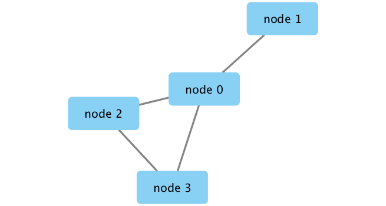

```{r setup, include=FALSE}
knitr::opts_chunk$set(echo = TRUE)
```

```{r}
library(RCy3)
library(igraph)
library(RColorBrewer)
```

```{r}
cytoscapePing()
# Check the version
cytoscapeVersionInfo()
```

```{r}
g <- makeSimpleIgraph()
createNetworkFromIgraph(g, "myGraph")
```

```{r}
fig <- exportImage(filename="demo", type="png", height=350)
```

```{r}


```
```{r}
setVisualStyle("Marquee")
```


```{r}
fig <- exportImage(filename="demo_marquee", type="png", height=350)

knitr::include_graphics("./demo_marquee.png")
```
STYLEZZZZ
```{r}
styles <- getVisualStyleNames()
styles
```

```{r}
degree(g)
```
Read in the metagenomic data
```{r}
prok_vir_cor <- read.delim("./virus_prok_cor_abundant.tsv", stringsAsFactors = F)

# have a peak at the first 6 rows 
head(prok_vir_cor)
```

How many edges will we have?
```{r}
#how may entries = the number of edges
nrow(prok_vir_cor)
```
How many unique sequences are there?
```{r}
length(unique(c(prok_vir_cor[,1], prok_vir_cor[,2])))
```
```{r}
g <- graph.data.frame(prok_vir_cor, directed = F)
class(g)
plot(g)
```

```{r}
plot(g, vertex.label=NA)
```
```{r}
plot(g, vertex.size=3, vertex.label=NA)

```
```{r}
 library("ggraph")
```
```{r}
ggraph(g, layout = 'auto') +
  geom_edge_link(alpha = 0.25) +
  geom_node_point(color="steelblue") +
  theme_graph()
```
Let's calculate some things 
Community detection with Girvin Newman:
```{r}
cb <- cluster_edge_betweenness(g)
```

[plot]

```{r}
plot(cb, y=g, vertex.label=NA,  vertex.size=3)
```
Identify the members of each cluster 
```{r}
head( membership(cb) )
```

Calculate and plot node degree of our network
```{r}
d <- degree(g)
hist(d, breaks=30, col=rainbow(10), main ="Node Degree Distribution")
```

PLOT!
```{r}
plot(degree_distribution(g), type = "h")
```
**Centrality analysis**
Centrality gives an estimation on how important a node or edge is for the connectivity (or the information flow) of a network. It is a particularly useful parameter in signaling networks and it is often used when trying to find drug targets for example.

Centrality analysis often aims to answer the following question: Which nodes are the most important and why?

One centrality method that you can often find in publications is the Google PageRank score. For the explanation of the PageRank algorithm, see the following webpage: http://infolab.stanford.edu/~backrub/google.html
```{r}
pr <- page_rank(g)
head(pr$vector)
```
Lets plot our network with nodes size scaled via this page rank centrality scores.
```{r}
# Make a size vector btwn 2 and 20 for node plotting size
library("BBmisc")

v.size <- BBmisc::normalize(pr$vector, range=c(2,20), method="range")


plot(g, vertex.size=v.size, vertex.label=NA)
```
Plot out the object "d"

```{r}
v.size <- BBmisc::normalize(d, range=c(2, 20), method="range")
plot(g, vertex.size=v.size, vertex.label=NA)
```
Another very common centrality score is betweenness. The vertex and edge betweenness are (roughly) defined by the number of geodesics (shortest paths) going through a vertex or an edge.


```{r}
b <- betweenness(g)
v.size <- BBmisc::normalize(b, range=c(2, 20), method="range")
plot(g, vertex.size=v.size, vertex.label=NA)
```
**Read taxonomic classification for network annotation**
Since these are data from small, microscopic organisms that were sequenced using shotgun sequencing, we rely on the classification of the sequences to know what kind of organisms are in the samples. In this case the bacterial viruses (bacteriophage), were classified by Basic Local Alignment Search Tool (BLAST http://blast.ncbi.nlm.nih.gov/Blast.cgi) by searching for their closest sequence in the RefSeq database (see methods in Brum et al. (2015)). The prokaryotic taxonomic classifications were determined using the SILVA database.
```{r}
phage_id_affiliation <- read.delim("./phage_ids_with_affiliation.tsv")
head(phage_id_affiliation)
```

```{r}
bac_id_affi <- read.delim("./prok_tax_from_silva.tsv", stringsAsFactors = FALSE)
head(bac_id_affi)
```
**Add taxonomic annotation data to network**
In preparation for sending the networks to Cytoscape we will add in the taxonomic data.
```{r}
## Extract out our vertex names
genenet.nodes <- as.data.frame(vertex.attributes(g), stringsAsFactors=FALSE)
head(genenet.nodes)
```

How may phage (i.e. ph_) entries do we have?

```{r}
length(grep("ph", genenet.nodes[,1]))
```
Now lets merge() these with the annotation data
```{r}
z <- bac_id_affi[, c("Accession_ID", "Kingdom", "Phylum", "Class")]
n <- merge(genenet.nodes, z, by.x="name", by.y="Accession_ID", all.x=TRUE)
head(n)
# Check on the column names before deciding what to merge
colnames(n)
```
```{r}
colnames(phage_id_affiliation)
```

```{r}
# Again we only need a subset of `phage_id_affiliation` for our purposes
y <- phage_id_affiliation[, c("first_sheet.Phage_id_network", "phage_affiliation","Tax_order", "Tax_subfamily")]
# Add the little phage annotation that we have
x <- merge(x=n, y=y, by.x="name", by.y="first_sheet.Phage_id_network", all.x=TRUE)
# remove duplicates 
x <- x[!duplicated( (x$name) ),]
head(x)
```
Save our merged data back to genent.nodes 
```{r}
genenet.nodes <- x

```

**Send network to Cytoscape using RCy3**
Now we will send this network from R to Cytoscape.

To begin we will delete any windows and networks that were already open in Cytoscape. This will clean the slate and help ensure we don't use up all of our memory.

```{r}
# Open a new connection and delete any existing windows/networks in Cy
deleteAllNetworks()
```

```{r}
# Set the main nodes colname to the required "id" 
colnames(genenet.nodes)[1] <- "id"
```
Add to the network the data related to the connections between the organisms, the edge data, and then send the nodes and edges data.frames to Cytoscape using the function createNetworkFromDataFrames().
```{r}
genenet.edges <- data.frame(igraph::as_edgelist(g))

# Set the main edges colname to the required "source" and "target" 
colnames(genenet.edges) <- c("source","target")

# Add the weight from igraph to a new column...
genenet.edges$Weight <- igraph::edge_attr(g)$weight

# Send as a new network to Cytoscape
createNetworkFromDataFrames(genenet.nodes,genenet.edges, 
                            title="Tara_Oceans")
```

