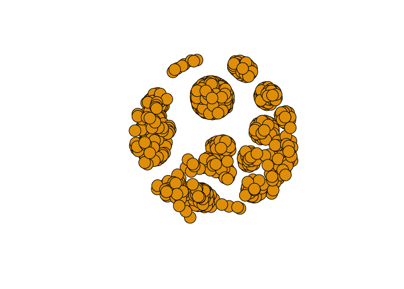
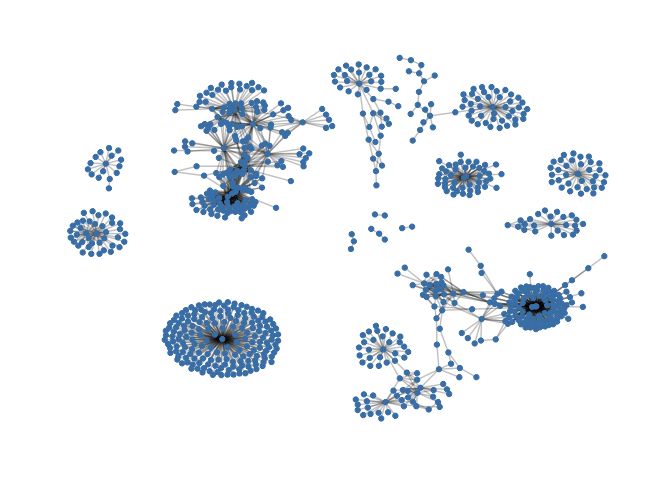
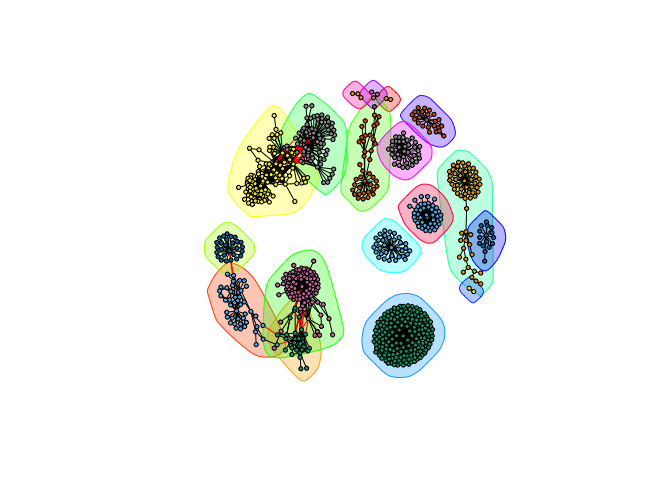
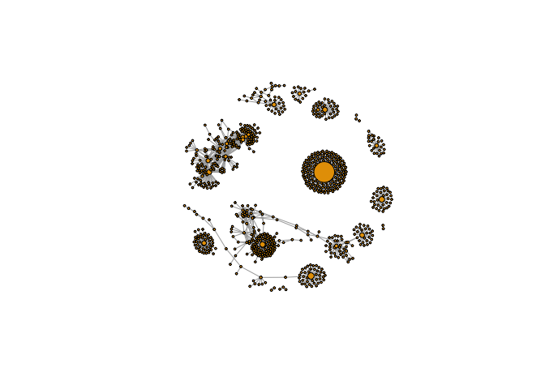
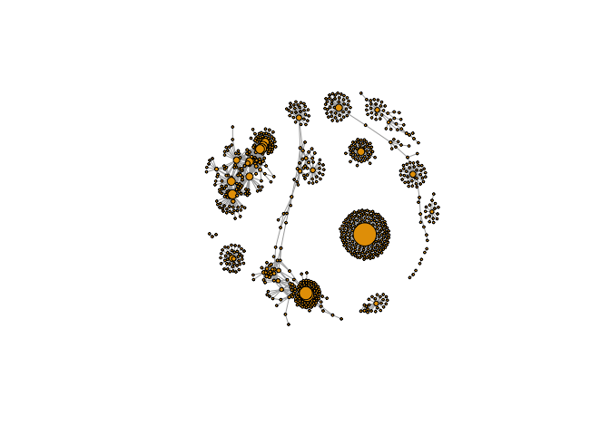
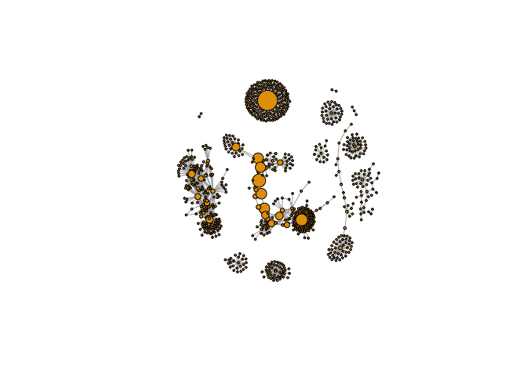

Day 17
================

``` r
library(RCy3)
library(igraph)
```

    ## 
    ## Attaching package: 'igraph'

    ## The following objects are masked from 'package:stats':
    ## 
    ##     decompose, spectrum

    ## The following object is masked from 'package:base':
    ## 
    ##     union

``` r
library(RColorBrewer)
```

``` r
cytoscapePing()
```

    ## [1] "You are connected to Cytoscape!"

``` r
# Check the version
cytoscapeVersionInfo()
```

    ##       apiVersion cytoscapeVersion 
    ##             "v1"          "3.7.1"

``` r
g <- makeSimpleIgraph()
createNetworkFromIgraph(g, "myGraph")
```

    ## Loading data...
    ## Applying default style...
    ## Applying preferred layout...

    ## networkSUID 
    ##        4970

``` r
fig <- exportImage(filename="demo", type="png", height=350)
```

``` r
knitr::include_graphics("./demo.png")
```

<!-- -->

``` r
setVisualStyle("Marquee")
```

    ##                 message 
    ## "Visual Style applied."

``` r
fig <- exportImage(filename="demo_marquee", type="png", height=350)


```

<!-- --> STYLEZZZZ

``` r
styles <- getVisualStyleNames()
styles
```

    ##  [1] "Directed"             "BioPAX_SIF"           "Big Labels"          
    ##  [4] "Sample3"              "Nested Network Style" "BioPAX"              
    ##  [7] "Solid"                "Universe"             "Gradient1"           
    ## [10] "Ripple"               "Marquee"              "Sample2"             
    ## [13] "size_rank"            "Curved"               "default"             
    ## [16] "default black"        "Minimal"              "Sample1"

``` r
degree(g)
```

    ## node 0 node 1 node 2 node 3 
    ##      3      1      2      2

Read in the metagenomic
data

``` r
prok_vir_cor <- read.delim("./virus_prok_cor_abundant.tsv", stringsAsFactors = F)

# have a peak at the first 6 rows 
head(prok_vir_cor)
```

    ##       Var1          Var2    weight
    ## 1  ph_1061 AACY020068177 0.8555342
    ## 2  ph_1258 AACY020207233 0.8055750
    ## 3  ph_3164 AACY020207233 0.8122517
    ## 4  ph_1033 AACY020255495 0.8487498
    ## 5 ph_10996 AACY020255495 0.8734617
    ## 6 ph_11038 AACY020255495 0.8740782

How many edges will we have?

``` r
#how may entries = the number of edges
nrow(prok_vir_cor)
```

    ## [1] 1544

How many unique sequences are there?

``` r
length(unique(c(prok_vir_cor[,1], prok_vir_cor[,2])))
```

    ## [1] 845

``` r
g <- graph.data.frame(prok_vir_cor, directed = F)
class(g)
```

    ## [1] "igraph"

``` r
plot(g)
```

<!-- -->

``` r
plot(g, vertex.label=NA)
```

<!-- -->

``` r
plot(g, vertex.size=3, vertex.label=NA)
```

<!-- -->

``` r
 library("ggraph")
```

    ## Loading required package: ggplot2

``` r
ggraph(g, layout = 'auto') +
  geom_edge_link(alpha = 0.25) +
  geom_node_point(color="steelblue") +
  theme_graph()
```

    ## Using `nicely` as default layout

<!-- --> Let’s
calculate some things Community detection with Girvin
    Newman:

``` r
cb <- cluster_edge_betweenness(g)
```

    ## Warning in cluster_edge_betweenness(g): At community.c:460 :Membership
    ## vector will be selected based on the lowest modularity score.

    ## Warning in cluster_edge_betweenness(g): At community.c:467 :Modularity
    ## calculation with weighted edge betweenness community detection might not
    ## make sense -- modularity treats edge weights as similarities while edge
    ## betwenness treats them as distances

\[plot\]

``` r
plot(cb, y=g, vertex.label=NA,  vertex.size=3)
```

<!-- --> Identify the
members of each cluster

``` r
head( membership(cb) )
```

    ##  ph_1061  ph_1258  ph_3164  ph_1033 ph_10996 ph_11038 
    ##        1        2        3        4        4        4

Calculate and plot node degree of our network

``` r
d <- degree(g)
hist(d, breaks=30, col=rainbow(10), main ="Node Degree Distribution")
```

<!-- -->

PLOT\!

``` r
plot(degree_distribution(g), type = "h")
```

<!-- --> **Centrality
analysis** Centrality gives an estimation on how important a node or
edge is for the connectivity (or the information flow) of a network. It
is a particularly useful parameter in signaling networks and it is often
used when trying to find drug targets for example.

Centrality analysis often aims to answer the following question: Which
nodes are the most important and why?

One centrality method that you can often find in publications is the
Google PageRank score. For the explanation of the PageRank algorithm,
see the following webpage:
<http://infolab.stanford.edu/~backrub/google.html>

``` r
pr <- page_rank(g)
head(pr$vector)
```

    ##      ph_1061      ph_1258      ph_3164      ph_1033     ph_10996 
    ## 0.0011834320 0.0011599483 0.0019042088 0.0005788564 0.0005769663 
    ##     ph_11038 
    ## 0.0005745460

Lets plot our network with nodes size scaled via this page rank
centrality scores.

``` r
# Make a size vector btwn 2 and 20 for node plotting size
library("BBmisc")
```

    ## 
    ## Attaching package: 'BBmisc'

    ## The following object is masked from 'package:igraph':
    ## 
    ##     normalize

    ## The following object is masked from 'package:base':
    ## 
    ##     isFALSE

``` r
v.size <- BBmisc::normalize(pr$vector, range=c(2,20), method="range")


plot(g, vertex.size=v.size, vertex.label=NA)
```

<!-- --> Plot out the
object “d”

``` r
v.size <- BBmisc::normalize(d, range=c(2, 20), method="range")
plot(g, vertex.size=v.size, vertex.label=NA)
```

<!-- --> Another very
common centrality score is betweenness. The vertex and edge betweenness
are (roughly) defined by the number of geodesics (shortest paths) going
through a vertex or an edge.

``` r
b <- betweenness(g)
v.size <- BBmisc::normalize(b, range=c(2, 20), method="range")
plot(g, vertex.size=v.size, vertex.label=NA)
```

<!-- --> **Read
taxonomic classification for network annotation** Since these are data
from small, microscopic organisms that were sequenced using shotgun
sequencing, we rely on the classification of the sequences to know what
kind of organisms are in the samples. In this case the bacterial viruses
(bacteriophage), were classified by Basic Local Alignment Search Tool
(BLAST <http://blast.ncbi.nlm.nih.gov/Blast.cgi>) by searching for their
closest sequence in the RefSeq database (see methods in Brum et al.
(2015)). The prokaryotic taxonomic classifications were determined using
the SILVA database.

``` r
phage_id_affiliation <- read.delim("./phage_ids_with_affiliation.tsv")
head(phage_id_affiliation)
```

    ##   first_sheet.Phage_id first_sheet.Phage_id_network phage_affiliation
    ## 1        109DCM_115804                       ph_775              <NA>
    ## 2        109DCM_115804                       ph_775              <NA>
    ## 3        109DCM_115804                       ph_775              <NA>
    ## 4        109DCM_115804                       ph_775              <NA>
    ## 5        109DCM_115804                       ph_775              <NA>
    ## 6        109DCM_115804                       ph_775              <NA>
    ##   Domain DNA_or_RNA Tax_order Tax_subfamily Tax_family Tax_genus
    ## 1   <NA>       <NA>      <NA>          <NA>       <NA>      <NA>
    ## 2   <NA>       <NA>      <NA>          <NA>       <NA>      <NA>
    ## 3   <NA>       <NA>      <NA>          <NA>       <NA>      <NA>
    ## 4   <NA>       <NA>      <NA>          <NA>       <NA>      <NA>
    ## 5   <NA>       <NA>      <NA>          <NA>       <NA>      <NA>
    ## 6   <NA>       <NA>      <NA>          <NA>       <NA>      <NA>
    ##   Tax_species
    ## 1        <NA>
    ## 2        <NA>
    ## 3        <NA>
    ## 4        <NA>
    ## 5        <NA>
    ## 6        <NA>

``` r
bac_id_affi <- read.delim("./prok_tax_from_silva.tsv", stringsAsFactors = FALSE)
head(bac_id_affi)
```

    ##    Accession_ID  Kingdom         Phylum          Class             Order
    ## 1 AACY020068177 Bacteria    Chloroflexi   SAR202 clade marine metagenome
    ## 2 AACY020125842  Archaea  Euryarchaeota Thermoplasmata Thermoplasmatales
    ## 3 AACY020187844  Archaea  Euryarchaeota Thermoplasmata Thermoplasmatales
    ## 4 AACY020105546 Bacteria Actinobacteria Actinobacteria             PeM15
    ## 5 AACY020281370  Archaea  Euryarchaeota Thermoplasmata Thermoplasmatales
    ## 6 AACY020147130  Archaea  Euryarchaeota Thermoplasmata Thermoplasmatales
    ##              Family             Genus Species
    ## 1              <NA>              <NA>    <NA>
    ## 2   Marine Group II marine metagenome    <NA>
    ## 3   Marine Group II marine metagenome    <NA>
    ## 4 marine metagenome              <NA>    <NA>
    ## 5   Marine Group II marine metagenome    <NA>
    ## 6   Marine Group II marine metagenome    <NA>

**Add taxonomic annotation data to network** In preparation for sending
the networks to Cytoscape we will add in the taxonomic data.

``` r
## Extract out our vertex names
genenet.nodes <- as.data.frame(vertex.attributes(g), stringsAsFactors=FALSE)
head(genenet.nodes)
```

    ##       name
    ## 1  ph_1061
    ## 2  ph_1258
    ## 3  ph_3164
    ## 4  ph_1033
    ## 5 ph_10996
    ## 6 ph_11038

How may phage (i.e. ph\_) entries do we have?

``` r
length(grep("ph", genenet.nodes[,1]))
```

    ## [1] 764

Now lets merge() these with the annotation data

``` r
z <- bac_id_affi[, c("Accession_ID", "Kingdom", "Phylum", "Class")]
n <- merge(genenet.nodes, z, by.x="name", by.y="Accession_ID", all.x=TRUE)
head(n)
```

    ##            name  Kingdom          Phylum               Class
    ## 1 AACY020068177 Bacteria     Chloroflexi        SAR202 clade
    ## 2 AACY020207233 Bacteria Deferribacteres     Deferribacteres
    ## 3 AACY020255495 Bacteria  Proteobacteria Gammaproteobacteria
    ## 4 AACY020288370 Bacteria  Actinobacteria      Acidimicrobiia
    ## 5 AACY020396101 Bacteria  Actinobacteria      Acidimicrobiia
    ## 6 AACY020398456 Bacteria  Proteobacteria Gammaproteobacteria

``` r
# Check on the column names before deciding what to merge
colnames(n)
```

    ## [1] "name"    "Kingdom" "Phylum"  "Class"

``` r
colnames(phage_id_affiliation)
```

    ##  [1] "first_sheet.Phage_id"         "first_sheet.Phage_id_network"
    ##  [3] "phage_affiliation"            "Domain"                      
    ##  [5] "DNA_or_RNA"                   "Tax_order"                   
    ##  [7] "Tax_subfamily"                "Tax_family"                  
    ##  [9] "Tax_genus"                    "Tax_species"

``` r
# Again we only need a subset of `phage_id_affiliation` for our purposes
y <- phage_id_affiliation[, c("first_sheet.Phage_id_network", "phage_affiliation","Tax_order", "Tax_subfamily")]
# Add the little phage annotation that we have
x <- merge(x=n, y=y, by.x="name", by.y="first_sheet.Phage_id_network", all.x=TRUE)
# remove duplicates 
x <- x[!duplicated( (x$name) ),]
head(x)
```

    ##            name  Kingdom          Phylum               Class
    ## 1 AACY020068177 Bacteria     Chloroflexi        SAR202 clade
    ## 2 AACY020207233 Bacteria Deferribacteres     Deferribacteres
    ## 3 AACY020255495 Bacteria  Proteobacteria Gammaproteobacteria
    ## 4 AACY020288370 Bacteria  Actinobacteria      Acidimicrobiia
    ## 5 AACY020396101 Bacteria  Actinobacteria      Acidimicrobiia
    ## 6 AACY020398456 Bacteria  Proteobacteria Gammaproteobacteria
    ##   phage_affiliation Tax_order Tax_subfamily
    ## 1              <NA>      <NA>          <NA>
    ## 2              <NA>      <NA>          <NA>
    ## 3              <NA>      <NA>          <NA>
    ## 4              <NA>      <NA>          <NA>
    ## 5              <NA>      <NA>          <NA>
    ## 6              <NA>      <NA>          <NA>

Save our merged data back to genent.nodes

``` r
genenet.nodes <- x
```

**Send network to Cytoscape using RCy3** Now we will send this network
from R to Cytoscape.

To begin we will delete any windows and networks that were already open
in Cytoscape. This will clean the slate and help ensure we don’t use up
all of our memory.

``` r
# Open a new connection and delete any existing windows/networks in Cy
deleteAllNetworks()
```

``` r
# Set the main nodes colname to the required "id" 
colnames(genenet.nodes)[1] <- "id"
```

Add to the network the data related to the connections between the
organisms, the edge data, and then send the nodes and edges data.frames
to Cytoscape using the function createNetworkFromDataFrames().

``` r
genenet.edges <- data.frame(igraph::as_edgelist(g))

# Set the main edges colname to the required "source" and "target" 
colnames(genenet.edges) <- c("source","target")

# Add the weight from igraph to a new column...
genenet.edges$Weight <- igraph::edge_attr(g)$weight

# Send as a new network to Cytoscape
createNetworkFromDataFrames(genenet.nodes,genenet.edges, 
                            title="Tara_Oceans")
```

    ## Loading data...
    ## Applying default style...
    ## Applying preferred layout...

    ## networkSUID 
    ##        5014
