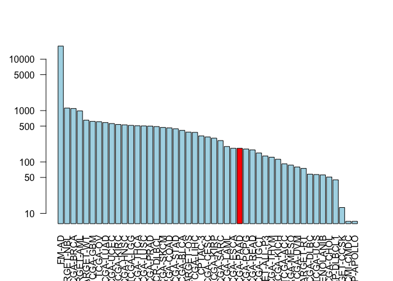
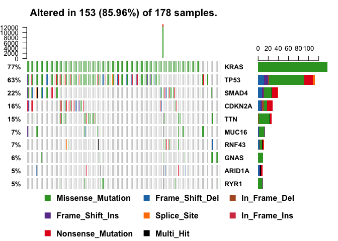
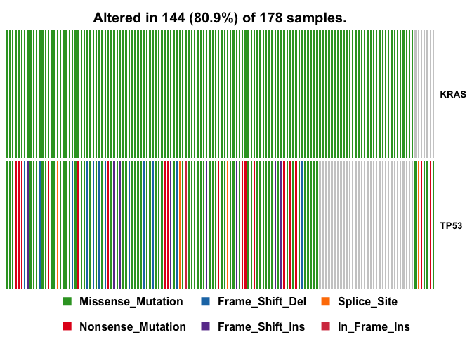
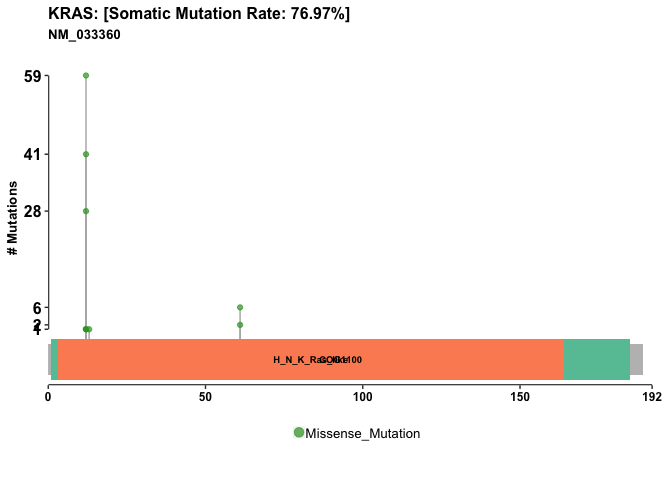
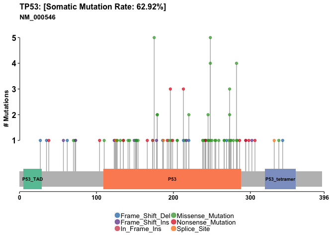

Day 18 (part 1 and 2)
================
Tiani Louis
5/31/2019

## The GenomicDataCommons R package

The workflow will be:

Install packages if not already installed Load libraries Identify and
download somatic variants for a representative TCGA dataset, in this
case pancreatic adenocarcinoma. Use maftools to provide rich summaries
of the data.

``` r
#source("https://bioconductor.org/biocLite.R")
#BiocManager::install("GenomicDataCommons")
#BiocManager::install("TCGAbiolinks")
#BiocManager::install("maftools")
```

``` r
library(GenomicDataCommons)
```

    ## Loading required package: magrittr

    ## 
    ## Attaching package: 'GenomicDataCommons'

    ## The following object is masked from 'package:stats':
    ## 
    ##     filter

``` r
library("TCGAbiolinks")
```

    ## Warning: package 'TCGAbiolinks' was built under R version 3.5.3

``` r
library(maftools)
```

    ## Warning: package 'maftools' was built under R version 3.5.3

``` r
status()
```

    ## $commit
    ## [1] "3e22a4257d5079ae9f7193950b51ed9dfc561ed1"
    ## 
    ## $data_release
    ## [1] "Data Release 17.0 - June 05, 2019"
    ## 
    ## $status
    ## [1] "OK"
    ## 
    ## $tag
    ## [1] "1.21.0"
    ## 
    ## $version
    ## [1] 1

# Querying the GDC from R

``` r
projects <- getGDCprojects()
head(projects)
```

    ##   dbgap_accession_number
    ## 1              phs001287
    ## 2              phs001374
    ## 3              phs001628
    ## 4              phs000466
    ## 5              phs000467
    ## 6              phs001179
    ##                                                                                                                                                                                                                                                                                                                                                                                                                                                                                                                                                                                                                                 disease_type
    ## 1                                                                                                                                                                                                                                                                                                                                                                                                                                                                                                                                                                                                               Adenomas and Adenocarcinomas
    ## 2                                                                                                                                                                                                                                                                                                                                                                                                                                                                                                                                                                                         Epithelial Neoplasms, NOS, Squamous Cell Neoplasms
    ## 3                                                                                                                                                                                                                                                                                                                                                                                                                                                                                                                                                                                                                          Myeloid Leukemias
    ## 4                                                                                                                                                                                                                                                                                                                                                                                                                                                                                                                                                                                                           Clear Cell Sarcoma of the Kidney
    ## 5                                                                                                                                                                                                                                                                                                                                                                                                                                                                                                                                                                                                                              Neuroblastoma
    ## 6 Germ Cell Neoplasms, Acinar Cell Neoplasms, Miscellaneous Tumors, Thymic Epithelial Neoplasms, Gliomas, Basal Cell Neoplasms, Neuroepitheliomatous Neoplasms, Ductal and Lobular Neoplasms, Complex Mixed and Stromal Neoplasms, Complex Epithelial Neoplasms, Adnexal and Skin Appendage Neoplasms, Mesothelial Neoplasms, Mucoepidermoid Neoplasms, Not Reported, Specialized Gonadal Neoplasms, Cystic, Mucinous and Serous Neoplasms, Adenomas and Adenocarcinomas, Epithelial Neoplasms, NOS, Squamous Cell Neoplasms, Transitional Cell Papillomas and Carcinomas, Paragangliomas and Glomus Tumors, Nevi and Melanomas, Meningiomas
    ##   releasable released state
    ## 1      FALSE     TRUE  open
    ## 2      FALSE     TRUE  open
    ## 3      FALSE     TRUE  open
    ## 4       TRUE     TRUE  open
    ## 5       TRUE     TRUE  open
    ## 6      FALSE     TRUE  open
    ##                                                                                                                                                                                                                                                                                                                                                                                                                                                                                                                                                                                                                                                                                                                                                                                                                                                               primary_site
    ## 1                                                                                                                                                                                                                                                                                                                                                                                                                                                                                                                                                                                                                                                                                                                                                                                                                                   Kidney, Bronchus and lung, Uterus, NOS
    ## 2                                                                                                                                                                                                                                                                                                                                                                                                                                                                                                                                                                                                                                                                                                                                                                                                                                                        Bronchus and lung
    ## 3                                                                                                                                                                                                                                                                                                                                                                                                                                                                                                                                                                                                                                                                                                                                                                                                                            Hematopoietic and reticuloendothelial systems
    ## 4                                                                                                                                                                                                                                                                                                                                                                                                                                                                                                                                                                                                                                                                                                                                                                                                                                                                   Kidney
    ## 5                                                                                                                                                                                                                                                                                                                                                                                                                                                                                                                                                                                                                                                                                                                                                                                                                                                           Nervous System
    ## 6 Testis, Gallbladder, Unknown, Other and unspecified parts of biliary tract, Adrenal gland, Thyroid gland, Spinal cord, cranial nerves, and other parts of central nervous system, Peripheral nerves and autonomic nervous system, Stomach, Cervix uteri, Bladder, Small intestine, Breast, Prostate gland, Other and unspecified female genital organs, Other and unspecified major salivary glands, Rectum, Retroperitoneum and peritoneum, Pancreas, Heart, mediastinum, and pleura, Bronchus and lung, Liver and intrahepatic bile ducts, Other and ill-defined sites, Thymus, Penis, Nasopharynx, Ovary, Uterus, NOS, Vulva, Anus and anal canal, Other and unspecified urinary organs, Trachea, Ureter, Other endocrine glands and related structures, Not Reported, Colon, Kidney, Vagina, Skin, Esophagus, Eye and adnexa, Other and ill-defined digestive organs
    ##              project_id                    id
    ## 1               CPTAC-3               CPTAC-3
    ## 2        VAREPOP-APOLLO        VAREPOP-APOLLO
    ## 3 BEATAML1.0-CRENOLANIB BEATAML1.0-CRENOLANIB
    ## 4           TARGET-CCSK           TARGET-CCSK
    ## 5            TARGET-NBL            TARGET-NBL
    ## 6                 FM-AD                 FM-AD
    ##                                                                                              name
    ## 1                                                                                                
    ## 2                                                          VA Research Precision Oncology Program
    ## 3 Clinical Resistance to Crenolanib in Acute Myeloid Leukemia Due to Diverse Molecular Mechanisms
    ## 4                                                                Clear Cell Sarcoma of the Kidney
    ## 5                                                                                   Neuroblastoma
    ## 6                                       Foundation Medicine Adult Cancer Clinical Dataset (FM-AD)
    ##        tumor
    ## 1          3
    ## 2     APOLLO
    ## 3 CRENOLANIB
    ## 4       CCSK
    ## 5        NBL
    ## 6         AD

``` r
#browseVignettes("GenomicDataCommons")
BiocManager::available("GenomicDataCommons")
```

    ## [1] "GenomicDataCommons"

``` r
cases_by_project <- cases() %>%
  facet("project.project_id") %>%
  aggregations()
head(cases_by_project)
```

    ## $project.project_id
    ##                      key doc_count
    ## 1                  FM-AD     18004
    ## 2             TARGET-NBL      1120
    ## 3              TCGA-BRCA      1098
    ## 4             TARGET-AML       988
    ## 5              TARGET-WT       652
    ## 6               TCGA-GBM       617
    ## 7                TCGA-OV       608
    ## 8              TCGA-LUAD       585
    ## 9              TCGA-UCEC       560
    ## 10             TCGA-KIRC       537
    ## 11             TCGA-HNSC       528
    ## 12              TCGA-LGG       516
    ## 13             TCGA-THCA       507
    ## 14             TCGA-LUSC       504
    ## 15             TCGA-PRAD       500
    ## 16          NCICCR-DLBCL       489
    ## 17             TCGA-SKCM       470
    ## 18             TCGA-COAD       461
    ## 19             TCGA-STAD       443
    ## 20             TCGA-BLCA       412
    ## 21             TARGET-OS       381
    ## 22             TCGA-LIHC       377
    ## 23               CPTAC-3       322
    ## 24             TCGA-CESC       307
    ## 25             TCGA-KIRP       291
    ## 26             TCGA-SARC       261
    ## 27             TCGA-LAML       200
    ## 28             TCGA-ESCA       185
    ## 29             TCGA-PAAD       185
    ## 30             TCGA-PCPG       179
    ## 31             TCGA-READ       172
    ## 32             TCGA-TGCT       150
    ## 33         TARGET-ALL-P3       131
    ## 34             TCGA-THYM       124
    ## 35             TCGA-KICH       113
    ## 36              TCGA-ACC        92
    ## 37             TCGA-MESO        87
    ## 38              TCGA-UVM        80
    ## 39             TARGET-RT        75
    ## 40             TCGA-DLBC        58
    ## 41              TCGA-UCS        57
    ## 42 BEATAML1.0-CRENOLANIB        56
    ## 43             TCGA-CHOL        51
    ## 44           CTSP-DLBCL1        45
    ## 45           TARGET-CCSK        13
    ## 46             HCMI-CMDC         7
    ## 47        VAREPOP-APOLLO         7

``` r
x <- cases_by_project$project.project_id

x$key == "TCGA-PAAD"
```

    ##  [1] FALSE FALSE FALSE FALSE FALSE FALSE FALSE FALSE FALSE FALSE FALSE
    ## [12] FALSE FALSE FALSE FALSE FALSE FALSE FALSE FALSE FALSE FALSE FALSE
    ## [23] FALSE FALSE FALSE FALSE FALSE FALSE  TRUE FALSE FALSE FALSE FALSE
    ## [34] FALSE FALSE FALSE FALSE FALSE FALSE FALSE FALSE FALSE FALSE FALSE
    ## [45] FALSE FALSE FALSE

``` r
# Make a custom color vector for our plot
colvec <- rep("lightblue", nrow(x))
colvec[x$key == "TCGA-PAAD"] <- "red"

# Plot with 'log' for y axis and rotate labels with 'las'
#par(___)  
barplot(x$doc_count, names.arg=x$key, log="y", col=colvec, las=2)
```

<!-- --> Lets explore
some other functions from the related TCGAbiolinks package.

We can use the getSampleFilesSummary() function to determine for a given
project how many cases and what type of data we have available for each
case:

``` r
samp <- getSampleFilesSummary("TCGA-PAAD")
```

    ## Accessing information for project: TCGA-PAAD

    ## Using 'state_comment' as value column. Use 'value.var' to override

    ## Aggregation function missing: defaulting to length

``` r
head(samp)
```

    ##            .id Biospecimen_Biospecimen Supplement
    ## 1 TCGA-2J-AAB1                                 14
    ## 2 TCGA-2J-AAB4                                 14
    ## 3 TCGA-2J-AAB6                                 14
    ## 4 TCGA-2J-AAB8                                 14
    ## 5 TCGA-2J-AAB9                                 14
    ## 6 TCGA-2J-AABA                                 14
    ##   Biospecimen_Slide Image_Diagnostic Slide
    ## 1                                        1
    ## 2                                        1
    ## 3                                        1
    ## 4                                        1
    ## 5                                        1
    ## 6                                        1
    ##   Biospecimen_Slide Image_Tissue Slide Clinical_Clinical Supplement
    ## 1                                    1                            8
    ## 2                                    1                            8
    ## 3                                    1                            8
    ## 4                                    1                            8
    ## 5                                    1                            8
    ## 6                                    1                            8
    ##   Copy Number Variation_Copy Number Segment_Genotyping Array_Affymetrix SNP 6.0
    ## 1                                                                             2
    ## 2                                                                             2
    ## 3                                                                             2
    ## 4                                                                             2
    ## 5                                                                             2
    ## 6                                                                             2
    ##   Copy Number Variation_Gene Level Copy Number Scores_Genotyping Array_Affymetrix SNP 6.0
    ## 1                                                                                       1
    ## 2                                                                                       1
    ## 3                                                                                       1
    ## 4                                                                                       1
    ## 5                                                                                       1
    ## 6                                                                                       1
    ##   Copy Number Variation_Masked Copy Number Segment_Genotyping Array_Affymetrix SNP 6.0
    ## 1                                                                                    2
    ## 2                                                                                    2
    ## 3                                                                                    2
    ## 4                                                                                    2
    ## 5                                                                                    2
    ## 6                                                                                    2
    ##   DNA Methylation_Methylation Beta Value_Methylation Array_Illumina Human Methylation 450
    ## 1                                                                                       1
    ## 2                                                                                       1
    ## 3                                                                                       1
    ## 4                                                                                       1
    ## 5                                                                                       1
    ## 6                                                                                       1
    ##   Sequencing Reads_Aligned Reads_miRNA-Seq_Illumina
    ## 1                                                 1
    ## 2                                                 1
    ## 3                                                 1
    ## 4                                                 1
    ## 5                                                 1
    ## 6                                                 1
    ##   Sequencing Reads_Aligned Reads_RNA-Seq_Illumina
    ## 1                                               1
    ## 2                                               1
    ## 3                                               1
    ## 4                                               1
    ## 5                                               1
    ## 6                                               1
    ##   Sequencing Reads_Aligned Reads_WXS_Illumina
    ## 1                                           2
    ## 2                                           2
    ## 3                                           2
    ## 4                                           2
    ## 5                                           2
    ## 6                                           2
    ##   Simple Nucleotide Variation_Aggregated Somatic Mutation_WXS
    ## 1                                                           4
    ## 2                                                           4
    ## 3                                                           4
    ## 4                                                           4
    ## 5                                                           4
    ## 6                                                           4
    ##   Simple Nucleotide Variation_Annotated Somatic Mutation_WXS
    ## 1                                                          4
    ## 2                                                          4
    ## 3                                                          4
    ## 4                                                          4
    ## 5                                                          4
    ## 6                                                          4
    ##   Simple Nucleotide Variation_Masked Somatic Mutation_WXS
    ## 1                                                       4
    ## 2                                                       4
    ## 3                                                       4
    ## 4                                                       4
    ## 5                                                       4
    ## 6                                                       4
    ##   Simple Nucleotide Variation_Raw Simple Somatic Mutation_WXS
    ## 1                                                           4
    ## 2                                                           4
    ## 3                                                           4
    ## 4                                                           4
    ## 5                                                           4
    ## 6                                                           4
    ##   Transcriptome Profiling_Gene Expression Quantification_RNA-Seq
    ## 1                                                              3
    ## 2                                                              3
    ## 3                                                              3
    ## 4                                                              3
    ## 5                                                              3
    ## 6                                                              3
    ##   Transcriptome Profiling_Isoform Expression Quantification_miRNA-Seq
    ## 1                                                                   1
    ## 2                                                                   1
    ## 3                                                                   1
    ## 4                                                                   1
    ## 5                                                                   1
    ## 6                                                                   1
    ##   Transcriptome Profiling_miRNA Expression Quantification_miRNA-Seq
    ## 1                                                                 1
    ## 2                                                                 1
    ## 3                                                                 1
    ## 4                                                                 1
    ## 5                                                                 1
    ## 6                                                                 1
    ##     project
    ## 1 TCGA-PAAD
    ## 2 TCGA-PAAD
    ## 3 TCGA-PAAD
    ## 4 TCGA-PAAD
    ## 5 TCGA-PAAD
    ## 6 TCGA-PAAD

Now we can use GDCquery() function to focus in on a particular data type
that we are interested in. For example, to answer our second question
from above - namely ‘find all gene expression data files for all
pancreatic cancer patients’:

``` r
query <- GDCquery(project="TCGA-PAAD",
                  data.category="Transcriptome Profiling",
                  data.type="Gene Expression Quantification")
```

    ## --------------------------------------

    ## o GDCquery: Searching in GDC database

    ## --------------------------------------

    ## Genome of reference: hg38

    ## --------------------------------------------

    ## oo Accessing GDC. This might take a while...

    ## --------------------------------------------

    ## ooo Project: TCGA-PAAD

    ## --------------------

    ## oo Filtering results

    ## --------------------

    ## ooo By data.type

    ## ----------------

    ## oo Checking data

    ## ----------------

    ## ooo Check if there are duplicated cases

    ## Warning: There are more than one file for the same case. Please verify query results. You can use the command View(getResults(query)) in rstudio

    ## ooo Check if there results for the query

    ## -------------------

    ## o Preparing output

    ## -------------------

``` r
ans <- getResults(query)

head(ans)
```

    ##   data_release                      data_type
    ## 1  12.0 - 17.0 Gene Expression Quantification
    ## 2  12.0 - 17.0 Gene Expression Quantification
    ## 3  12.0 - 17.0 Gene Expression Quantification
    ## 4  12.0 - 17.0 Gene Expression Quantification
    ## 5  12.0 - 17.0 Gene Expression Quantification
    ## 6  12.0 - 17.0 Gene Expression Quantification
    ##                   updated_datetime
    ## 1 2019-05-23T23:18:56.468363+00:00
    ## 2 2019-05-23T23:18:56.468363+00:00
    ## 3 2019-05-23T23:18:56.468363+00:00
    ## 4 2019-05-23T23:18:56.468363+00:00
    ## 5 2019-05-23T23:18:56.468363+00:00
    ## 6 2019-05-23T23:18:56.468363+00:00
    ##                                              file_name
    ## 1  4df16e07-cdbc-46cc-8b9c-39d4a9dca09e.FPKM-UQ.txt.gz
    ## 2 1f997074-0020-47e6-9928-5bf7209c552d.htseq.counts.gz
    ## 3 cc133a8a-77ad-4570-852e-df72548c6897.htseq.counts.gz
    ## 4  e7cc80ef-4b87-47d9-bebe-1fb05b5b04a2.FPKM-UQ.txt.gz
    ## 5 232f085b-6201-4e4d-8473-e592b8d8e16d.htseq.counts.gz
    ## 6     a155ec07-2baf-404b-85bc-28330a8fee33.FPKM.txt.gz
    ##                                  submitter_id
    ## 1 4df16e07-cdbc-46cc-8b9c-39d4a9dca09e_uqfpkm
    ## 2  1f997074-0020-47e6-9928-5bf7209c552d_count
    ## 3  cc133a8a-77ad-4570-852e-df72548c6897_count
    ## 4 e7cc80ef-4b87-47d9-bebe-1fb05b5b04a2_uqfpkm
    ## 5  232f085b-6201-4e4d-8473-e592b8d8e16d_count
    ## 6   a155ec07-2baf-404b-85bc-28330a8fee33_fpkm
    ##                                file_id file_size
    ## 1 4ac5c2da-497f-4fb4-80db-c7e774c1873a    526515
    ## 2 78bb8d49-54aa-43a1-aec4-31da818cdb14    250443
    ## 3 82d7d3b5-85bc-46b9-b9cd-2bdeb279dc0f    255221
    ## 4 3cbf3948-3ac4-4824-9b6f-6efcf13066b5    556107
    ## 5 13dfd8da-5d36-48fa-a82c-77b5c5e77e7b    252815
    ## 6 c6a9b770-845a-4a10-ac02-28928def043c    504140
    ##                          cases                                   id
    ## 1 TCGA-YY-A8LH-01A-11R-A36G-07 4ac5c2da-497f-4fb4-80db-c7e774c1873a
    ## 2 TCGA-H6-A45N-01A-11R-A26U-07 78bb8d49-54aa-43a1-aec4-31da818cdb14
    ## 3 TCGA-RB-AA9M-01A-11R-A39D-07 82d7d3b5-85bc-46b9-b9cd-2bdeb279dc0f
    ## 4 TCGA-HZ-8637-01A-11R-2404-07 3cbf3948-3ac4-4824-9b6f-6efcf13066b5
    ## 5 TCGA-HZ-7918-01A-11R-2156-07 13dfd8da-5d36-48fa-a82c-77b5c5e77e7b
    ## 6 TCGA-2J-AABP-01A-11R-A41B-07 c6a9b770-845a-4a10-ac02-28928def043c
    ##                   created_datetime                           md5sum
    ## 1 2016-05-30T18:58:14.322399-05:00 fece0a61ad30a786de8ee50d25028d61
    ## 2 2016-05-30T18:21:31.785829-05:00 31eaf2ddc469f44cbbcddf92e631af67
    ## 3 2016-05-30T18:32:49.244208-05:00 435a535f7904090d6b97eb2eee7ed71e
    ## 4 2016-05-29T10:21:16.740924-05:00 9d250e9709c04a2005a93948fc8e11eb
    ## 5 2016-05-29T10:37:43.483990-05:00 fb22772a5d5948778ea2f77cdecb3050
    ## 6 2016-05-30T18:36:35.355486-05:00 7dd83ad6f57154e1ce9c921f2d61d7a3
    ##   data_format access    state version           data_category
    ## 1         TXT   open released       1 Transcriptome Profiling
    ## 2         TXT   open released       1 Transcriptome Profiling
    ## 3         TXT   open released       1 Transcriptome Profiling
    ## 4         TXT   open released       1 Transcriptome Profiling
    ## 5         TXT   open released       1 Transcriptome Profiling
    ## 6         TXT   open released       1 Transcriptome Profiling
    ##              type experimental_strategy   project
    ## 1 gene_expression               RNA-Seq TCGA-PAAD
    ## 2 gene_expression               RNA-Seq TCGA-PAAD
    ## 3 gene_expression               RNA-Seq TCGA-PAAD
    ## 4 gene_expression               RNA-Seq TCGA-PAAD
    ## 5 gene_expression               RNA-Seq TCGA-PAAD
    ## 6 gene_expression               RNA-Seq TCGA-PAAD
    ##                            analysis_id        analysis_updated_datetime
    ## 1 509f861f-23f1-4201-b0ea-90cfd03ccd49 2018-09-10T15:08:41.786316-05:00
    ## 2 e196345c-9a5d-481d-abd1-67c65c271283 2018-09-10T15:08:41.786316-05:00
    ## 3 7d970bb5-b3d5-4e90-9a32-cfddb0590287 2018-09-10T15:08:41.786316-05:00
    ## 4 f6899766-4888-436e-bc07-3158e2fbf0a9 2018-09-10T15:08:41.786316-05:00
    ## 5 3283f6cf-5aff-4833-b7a8-60726c06d7f6 2018-09-10T15:08:41.786316-05:00
    ## 6 21eda9da-73c8-44c2-a666-c7ca7a570a23 2018-09-10T15:08:41.786316-05:00
    ##          analysis_created_datetime
    ## 1 2016-05-30T18:58:14.322399-05:00
    ## 2 2016-05-30T18:21:31.785829-05:00
    ## 3 2016-05-30T18:32:49.244208-05:00
    ## 4 2016-05-29T10:21:16.740924-05:00
    ## 5 2016-05-29T10:37:43.483990-05:00
    ## 6 2016-05-30T18:36:35.355486-05:00
    ##                         analysis_submitter_id analysis_state
    ## 1 4df16e07-cdbc-46cc-8b9c-39d4a9dca09e_uqfpkm       released
    ## 2  1f997074-0020-47e6-9928-5bf7209c552d_count       released
    ## 3  cc133a8a-77ad-4570-852e-df72548c6897_count       released
    ## 4 e7cc80ef-4b87-47d9-bebe-1fb05b5b04a2_uqfpkm       released
    ## 5  232f085b-6201-4e4d-8473-e592b8d8e16d_count       released
    ## 6   a155ec07-2baf-404b-85bc-28330a8fee33_fpkm       released
    ##                 analysis_workflow_link analysis_workflow_type
    ## 1 https://github.com/NCI-GDC/htseq-cwl        HTSeq - FPKM-UQ
    ## 2 https://github.com/NCI-GDC/htseq-cwl         HTSeq - Counts
    ## 3 https://github.com/NCI-GDC/htseq-cwl         HTSeq - Counts
    ## 4 https://github.com/NCI-GDC/htseq-cwl        HTSeq - FPKM-UQ
    ## 5 https://github.com/NCI-GDC/htseq-cwl         HTSeq - Counts
    ## 6 https://github.com/NCI-GDC/htseq-cwl           HTSeq - FPKM
    ##   analysis_workflow_version   tissue.definition
    ## 1                        v1 Primary solid Tumor
    ## 2                        v1 Primary solid Tumor
    ## 3                        v1 Primary solid Tumor
    ## 4                        v1 Primary solid Tumor
    ## 5                        v1 Primary solid Tumor
    ## 6                        v1 Primary solid Tumor

In RStudio we can now use the View() function to get a feel for the data
organization and values in the returned ans object.

``` r
# View(ans)
```

We should see that ans contains a row for every RNA-Seq data file from
the ‘TCGA-PAAD’ project. At the time of writing this was 546 RNA-Seq
data files.

``` r
nrow(ans)
```

    ## [1] 546

We could download these with standard R tools, or for larger data-sets
such as this one, use the packages transfer() function, which uses the
GDC transfer client (a separate command-line tool) to perform more
robust data downloads.

\#Variant Analysis in R

Note we could go to the NCI-GDC web portal and enter the Advanced Search
page and then construct a search query to find MAF format somatic
mutation files for our ‘TCGA-PAAD’ project.

Lets do the same search in R with the help of the TCGAbiolinks package
function GDCquery\_Maf(). For brevity we will focus on only one of the
MAF files for this project, namely the MuTect2 workflow variant
    calls.

``` r
maf.file <- GDCquery_Maf(tumor = "PAAD", pipelines = "mutect")
```

    ## ============================================================================

    ##  For more information about MAF data please read the following GDC manual and web pages:

    ##  GDC manual: https://gdc-docs.nci.nih.gov/Data/PDF/Data_UG.pdf

    ##  https://gdc-docs.nci.nih.gov/Data/Bioinformatics_Pipelines/DNA_Seq_Variant_Calling_Pipeline/

    ##  https://gdc.cancer.gov/about-gdc/variant-calling-gdc

    ## ============================================================================

    ## --------------------------------------

    ## o GDCquery: Searching in GDC database

    ## --------------------------------------

    ## Genome of reference: hg38

    ## --------------------------------------------

    ## oo Accessing GDC. This might take a while...

    ## --------------------------------------------

    ## ooo Project: TCGA-PAAD

    ## --------------------

    ## oo Filtering results

    ## --------------------

    ## ooo By access

    ## ooo By data.type

    ## ooo By workflow.type

    ## ----------------

    ## oo Checking data

    ## ----------------

    ## ooo Check if there are duplicated cases

    ## ooo Check if there results for the query

    ## -------------------

    ## o Preparing output

    ## -------------------

    ## Downloading data for project TCGA-PAAD

    ## Of the 1 files for download 1 already exist.

    ## All samples have been already downloaded

``` r
head(maf.file)
```

    ## # A tibble: 6 x 120
    ##   Hugo_Symbol Entrez_Gene_Id Center NCBI_Build Chromosome Start_Position
    ##   <chr>                <int> <chr>  <chr>      <chr>               <int>
    ## 1 BCAN                 63827 BI     GRCh38     chr1            156651635
    ## 2 TNN                  63923 BI     GRCh38     chr1            175135891
    ## 3 PM20D1              148811 BI     GRCh38     chr1            205850012
    ## 4 CR1                   1378 BI     GRCh38     chr1            207523807
    ## 5 MLK4                 84451 BI     GRCh38     chr1            233372058
    ## 6 ITSN2                50618 BI     GRCh38     chr2             24310368
    ## # … with 114 more variables: End_Position <int>, Strand <chr>,
    ## #   Variant_Classification <chr>, Variant_Type <chr>,
    ## #   Reference_Allele <chr>, Tumor_Seq_Allele1 <chr>,
    ## #   Tumor_Seq_Allele2 <chr>, dbSNP_RS <chr>, dbSNP_Val_Status <chr>,
    ## #   Tumor_Sample_Barcode <chr>, Matched_Norm_Sample_Barcode <chr>,
    ## #   Match_Norm_Seq_Allele1 <lgl>, Match_Norm_Seq_Allele2 <lgl>,
    ## #   Tumor_Validation_Allele1 <chr>, Tumor_Validation_Allele2 <chr>,
    ## #   Match_Norm_Validation_Allele1 <lgl>,
    ## #   Match_Norm_Validation_Allele2 <lgl>, Verification_Status <lgl>,
    ## #   Validation_Status <lgl>, Mutation_Status <chr>,
    ## #   Sequencing_Phase <lgl>, Sequence_Source <lgl>,
    ## #   Validation_Method <chr>, Score <lgl>, BAM_File <lgl>, Sequencer <chr>,
    ## #   Tumor_Sample_UUID <chr>, Matched_Norm_Sample_UUID <chr>, HGVSc <chr>,
    ## #   HGVSp <chr>, HGVSp_Short <chr>, Transcript_ID <chr>,
    ## #   Exon_Number <chr>, t_depth <int>, t_ref_count <int>,
    ## #   t_alt_count <int>, n_depth <int>, n_ref_count <lgl>,
    ## #   n_alt_count <lgl>, all_effects <chr>, Allele <chr>, Gene <chr>,
    ## #   Feature <chr>, Feature_type <chr>, One_Consequence <chr>,
    ## #   Consequence <chr>, cDNA_position <chr>, CDS_position <chr>,
    ## #   Protein_position <chr>, Amino_acids <chr>, Codons <chr>,
    ## #   Existing_variation <chr>, ALLELE_NUM <int>, DISTANCE <dbl>,
    ## #   TRANSCRIPT_STRAND <int>, SYMBOL <chr>, SYMBOL_SOURCE <chr>,
    ## #   HGNC_ID <chr>, BIOTYPE <chr>, CANONICAL <chr>, CCDS <chr>, ENSP <chr>,
    ## #   SWISSPROT <chr>, TREMBL <chr>, UNIPARC <chr>, RefSeq <chr>,
    ## #   SIFT <chr>, PolyPhen <chr>, EXON <chr>, INTRON <chr>, DOMAINS <chr>,
    ## #   GMAF <dbl>, AFR_MAF <dbl>, AMR_MAF <dbl>, ASN_MAF <lgl>,
    ## #   EAS_MAF <dbl>, EUR_MAF <dbl>, SAS_MAF <dbl>, AA_MAF <dbl>,
    ## #   EA_MAF <dbl>, CLIN_SIG <chr>, SOMATIC <dbl>, PUBMED <chr>,
    ## #   MOTIF_NAME <lgl>, MOTIF_POS <lgl>, HIGH_INF_POS <lgl>,
    ## #   MOTIF_SCORE_CHANGE <lgl>, IMPACT <chr>, PICK <int>,
    ## #   VARIANT_CLASS <chr>, TSL <int>, HGVS_OFFSET <int>, PHENO <chr>,
    ## #   MINIMISED <int>, ExAC_AF <dbl>, ExAC_AF_Adj <dbl>, ExAC_AF_AFR <dbl>,
    ## #   ExAC_AF_AMR <dbl>, ExAC_AF_EAS <dbl>, ExAC_AF_FIN <dbl>, …

``` r
write.csv(maf.file, file = "./maf.csv")
```

**MAF analysis**

The MAF file contents is now stored as a dataframe and the maftools
package workflow, which starts with a MAF file or dataframe, can
proceed, starting with reading the pancreatic cancer MAF file.

``` r
vars <- read.maf(maf = maf.file, verbose = F)
```

With the data now available as a maftools MAF object, a lot of
functionality is available with little code. While the maftools package
offers quite a few functions, here are a few highlights. Cancer genomics
and bioinformatics researchers will recognize these plots.

# Plotting MAF summary.

We can use plotmafSummary() function to plot a summary of the maf
object, which displays number of variants in each sample as a stacked
barplot and variant types as a boxplot summarized by
Variant\_Classification. We can add either mean or median line to the
stacked barplot to display average/median number of variants across the
cohort.

``` r
plotmafSummary(vars)
```

<!-- -->

# Drawing oncoplots

A very useful summary representation of this data can be obtained via
so-called oncoplots, also known as waterfall plots.

``` r
# Oncoplot for our top 10 most frequently mutated genes
oncoplot(maf = vars, top = 10)
```

<!-- -->

``` r
#or
pdf("oncoplot_panc.pdf")
oncoplot(maf = vars, top = 10, fontSize = 12)
dev.off()
```

    ## quartz_off_screen 
    ##                 2

# Oncostrip

We can visualize any set of genes using the oncostrip() function, which
draws mutations in each sample similar to the graphic on the NCI-GDC web
portal. Note that oncostrip() can be used to draw any number of genes
using the input top or genes arguments

``` r
oncostrip(maf = vars, genes=c("KRAS", "TP53"))
```

<!-- --> Another plot
focusing on KRAS in our particular
    dataset.

``` r
lollipopPlot(vars, gene='KRAS')
```

    ## Assuming protein change information are stored under column HGVSp_Short. Use argument AACol to override if necessary.

    ## 2 transcripts available. Use arguments refSeqID or proteinID to manually specify tx name.

    ##    HGNC refseq.ID protein.ID aa.length
    ## 1: KRAS NM_004985  NP_004976       188
    ## 2: KRAS NM_033360  NP_203524       189

    ## Using longer transcript NM_033360 for now.

<!-- -->

``` r
lollipopPlot(vars, gene='TP53')
```

    ## Assuming protein change information are stored under column HGVSp_Short. Use argument AACol to override if necessary.

    ## 8 transcripts available. Use arguments refSeqID or proteinID to manually specify tx name.

    ##    HGNC    refseq.ID   protein.ID aa.length
    ## 1: TP53    NM_000546    NP_000537       393
    ## 2: TP53 NM_001126112 NP_001119584       393
    ## 3: TP53 NM_001126118 NP_001119590       354
    ## 4: TP53 NM_001126115 NP_001119587       261
    ## 5: TP53 NM_001126113 NP_001119585       346
    ## 6: TP53 NM_001126117 NP_001119589       214
    ## 7: TP53 NM_001126114 NP_001119586       341
    ## 8: TP53 NM_001126116 NP_001119588       209

    ## Using longer transcript NM_000546 for now.

<!-- --> \#\#\# PART 2
Q1: Identify sequence regions that contain all 9-mer peptides that are
only found in the tumor. Hint: You will need to first identify the sites
of mutation in the above sequences and then extract the surrounding
subsequence region. This subsequence should encompass all possible
9-mers in the tumor derived sequence. In other words extract the
subsequence from 8 residues before and 8 residues after all point
mutations in the tumor sequence.

``` r
library(bio3d)
```

``` r
seqs <- read.fasta("~/Downloads/lecture18_sequences.fa")
seqs
```

    ##              1        .         .         .         .         .         60 
    ## P53_wt       MEEPQSDPSVEPPLSQETFSDLWKLLPENNVLSPLPSQAMDDLMLSPDDIEQWFTEDPGP
    ## P53_mutant   MEEPQSDPSVEPPLSQETFSDLWKLLPENNVLSPLPSQAMLDLMLSPDDIEQWFTEDPGP
    ##              **************************************** ******************* 
    ##              1        .         .         .         .         .         60 
    ## 
    ##             61        .         .         .         .         .         120 
    ## P53_wt       DEAPRMPEAAPPVAPAPAAPTPAAPAPAPSWPLSSSVPSQKTYQGSYGFRLGFLHSGTAK
    ## P53_mutant   DEAPWMPEAAPPVAPAPAAPTPAAPAPAPSWPLSSSVPSQKTYQGSYGFRLGFLHSGTAK
    ##              **** ******************************************************* 
    ##             61        .         .         .         .         .         120 
    ## 
    ##            121        .         .         .         .         .         180 
    ## P53_wt       SVTCTYSPALNKMFCQLAKTCPVQLWVDSTPPPGTRVRAMAIYKQSQHMTEVVRRCPHHE
    ## P53_mutant   SVTCTYSPALNKMFCQLAKTCPVQLWVDSTPPPGTRVRAMAIYKQSQHMTEVVRRCPHHE
    ##              ************************************************************ 
    ##            121        .         .         .         .         .         180 
    ## 
    ##            181        .         .         .         .         .         240 
    ## P53_wt       RCSDSDGLAPPQHLIRVEGNLRVEYLDDRNTFRHSVVVPYEPPEVGSDCTTIHYNYMCNS
    ## P53_mutant   RCSDSDGLAPPQHLIRVEGNLRVEYLDDRNTFVHSVVVPYEPPEVGSDCTTIHYNYMCNS
    ##              ******************************** *************************** 
    ##            181        .         .         .         .         .         240 
    ## 
    ##            241        .         .         .         .         .         300 
    ## P53_wt       SCMGGMNRRPILTIITLEDSSGNLLGRNSFEVRVCACPGRDRRTEEENLRKKGEPHHELP
    ## P53_mutant   SCMGGMNRRPILTIITLEV-----------------------------------------
    ##              ******************                                           
    ##            241        .         .         .         .         .         300 
    ## 
    ##            301        .         .         .         .         .         360 
    ## P53_wt       PGSTKRALPNNTSSSPQPKKKPLDGEYFTLQIRGRERFEMFRELNEALELKDAQAGKEPG
    ## P53_mutant   ------------------------------------------------------------
    ##                                                                           
    ##            301        .         .         .         .         .         360 
    ## 
    ##            361        .         .         .  393 
    ## P53_wt       GSRAHSSHLKSKKGQSTSRHKKLMFKTEGPDSD
    ## P53_mutant   ---------------------------------
    ##                                                
    ##            361        .         .         .  393 
    ## 
    ## Call:
    ##   read.fasta(file = "~/Downloads/lecture18_sequences.fa")
    ## 
    ## Class:
    ##   fasta
    ## 
    ## Alignment dimensions:
    ##   2 sequence rows; 393 position columns (259 non-gap, 134 gap) 
    ## 
    ## + attr: id, ali, call

Create a matrix of positional identity scores

``` r
pos.id <- conserv(seqs$ali, method = "identity")
# identify important mutation sites 
mutant.sites <- which(pos.id < 1) 
```

exclude gaps

``` r
gaps <- gap.inspect(seqs)
mutant.sites <- mutant.sites[mutant.sites %in% gaps$f.inds]
mutant.sites
```

    ## [1]  41  65 213 259

We can use these indices in mutant.sites to extract subsequences as
required for the hands-on session. First however we come up with
suitable names for these subsequences based on the mutation. This will
help us later to make sense and keep track of our
results.

``` r
# extract information about the mutation type to name the mutations for future use 
# first extract the wt residue name/position then extract the mutant
mutant.names <- paste0(seqs$ali["P53_wt",mutant.sites],
                       mutant.sites,
                       seqs$ali["P53_mutant",mutant.sites])
mutant.names
```

    ## [1] "D41L"  "R65W"  "R213V" "D259V"

Now lets extract all 9-mer mutant encompassing sequences for each mutant
site. This is equivalent to finding the sequence region eight residues
before and eight residues after our mutation sites and outputting this
subsequence to a new FASTA file.

``` r
start.position <- mutant.sites - 8 
end.position <- mutant.sites + 8 
```

``` r
# Blank matrix to store sub-sequences
store.seqs <- matrix("-", nrow=length(mutant.sites), ncol=17)
rownames(store.seqs) <- mutant.names
```

``` r
# now creata a for loop to extract the surrounding sequences 
for (i in 1:length(mutant.sites)) {
  store.seqs[i,] <- seqs$ali["P53_mutant", start.position[i]:end.position[i]]
}

store.seqs
```

    ##       [,1] [,2] [,3] [,4] [,5] [,6] [,7] [,8] [,9] [,10] [,11] [,12] [,13]
    ## D41L  "S"  "P"  "L"  "P"  "S"  "Q"  "A"  "M"  "L"  "D"   "L"   "M"   "L"  
    ## R65W  "D"  "P"  "G"  "P"  "D"  "E"  "A"  "P"  "W"  "M"   "P"   "E"   "A"  
    ## R213V "Y"  "L"  "D"  "D"  "R"  "N"  "T"  "F"  "V"  "H"   "S"   "V"   "V"  
    ## D259V "I"  "L"  "T"  "I"  "I"  "T"  "L"  "E"  "V"  "-"   "-"   "-"   "-"  
    ##       [,14] [,15] [,16] [,17]
    ## D41L  "S"   "P"   "D"   "D"  
    ## R65W  "A"   "P"   "P"   "V"  
    ## R213V "V"   "P"   "Y"   "E"  
    ## D259V "-"   "-"   "-"   "-"

Finally lets output all these sequences to a FASTA file for further
analysis with the IEDB HLA binding prediction website
<http://tools.iedb.org/mhci/>.

``` r
## First blank out the gap positions 
store.seqs[store.seqs == "-"] <- ""
store.seqs
```

    ##       [,1] [,2] [,3] [,4] [,5] [,6] [,7] [,8] [,9] [,10] [,11] [,12] [,13]
    ## D41L  "S"  "P"  "L"  "P"  "S"  "Q"  "A"  "M"  "L"  "D"   "L"   "M"   "L"  
    ## R65W  "D"  "P"  "G"  "P"  "D"  "E"  "A"  "P"  "W"  "M"   "P"   "E"   "A"  
    ## R213V "Y"  "L"  "D"  "D"  "R"  "N"  "T"  "F"  "V"  "H"   "S"   "V"   "V"  
    ## D259V "I"  "L"  "T"  "I"  "I"  "T"  "L"  "E"  "V"  ""    ""    ""    ""   
    ##       [,14] [,15] [,16] [,17]
    ## D41L  "S"   "P"   "D"   "D"  
    ## R65W  "A"   "P"   "P"   "V"  
    ## R213V "V"   "P"   "Y"   "E"  
    ## D259V ""    ""    ""    ""

``` r
## Output a FASTA file for further analysis
write.fasta(seqs=store.seqs, ids=mutant.names, file="subsequences.fa")
```
