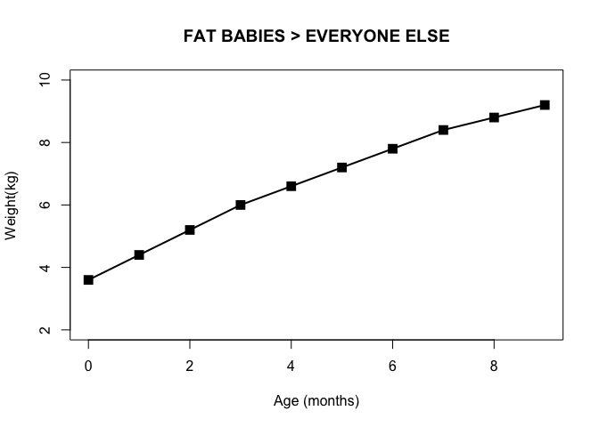
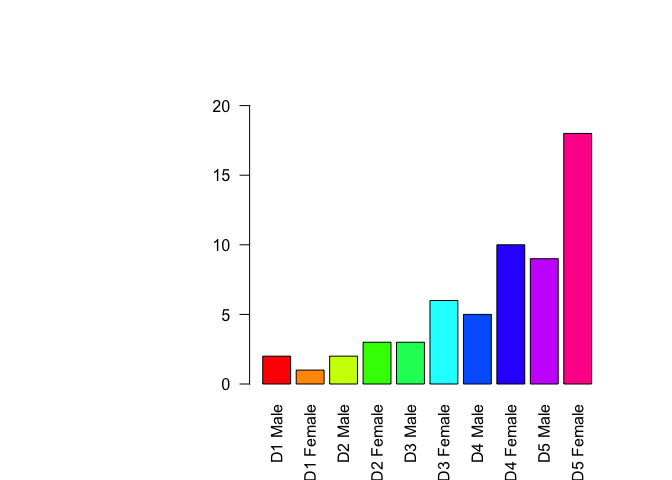
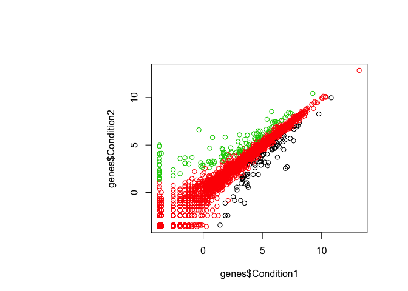
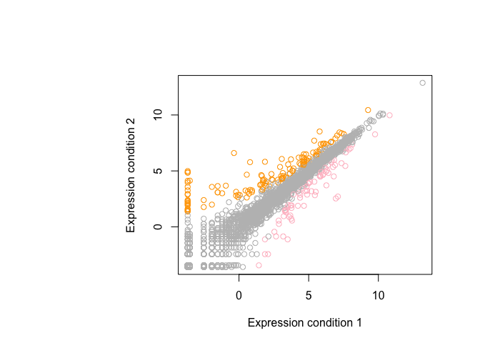
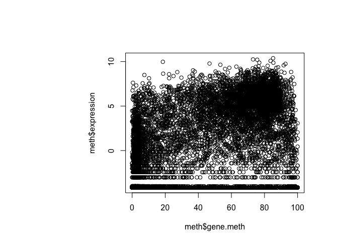
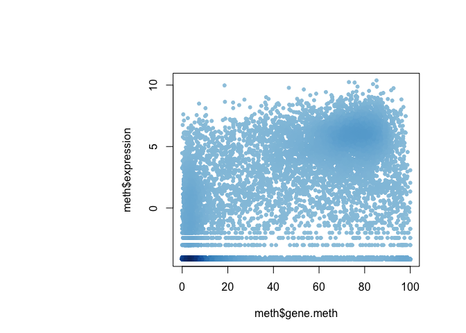
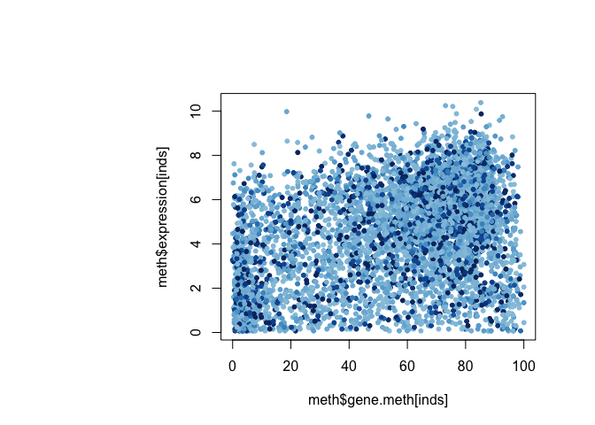
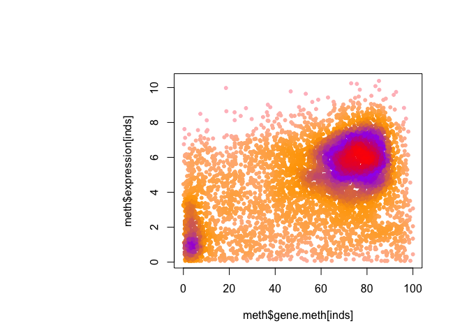

Day5.R
================
tianilouis
2019-05-03

``` r
# class 5 R graphics and plots 
#?read.table
weight <- read.table("bimm143_05_rstats/weight_chart.txt", header = T)
plot(weight, typ="o", pch=15, cex=1.5, lwd=2, ylim=c(2,10), xlab="Age (months)", ylab="Weight(kg)", main="FAT BABIES > EVERYONE ELSE")
```



``` r
read.table("bimm143_05_rstats/feature_counts.txt", header = T, sep = "\t")
```

    ##                    Feature Count
    ## 1            Messenger RNA 79049
    ## 2         Coding Sequences 50770
    ## 3                    Genes 32029
    ## 4            Transfer RNAs 26248
    ## 5              CpG islands 13840
    ## 6              Pseudogenes  5195
    ## 7               Micro-RNAs  1638
    ## 8     Small nucleolar RNAs  1602
    ## 9       Small nuclear RNAs  1431
    ## 10       Miscellaneous RNA   491
    ## 11 Immunoglobulin Segments   474
    ## 12          Ribosomal RNAs   341

``` r
read.table("bimm143_05_rstats/feature_counts.txt", header = T, sep = "\t")
```

    ##                    Feature Count
    ## 1            Messenger RNA 79049
    ## 2         Coding Sequences 50770
    ## 3                    Genes 32029
    ## 4            Transfer RNAs 26248
    ## 5              CpG islands 13840
    ## 6              Pseudogenes  5195
    ## 7               Micro-RNAs  1638
    ## 8     Small nucleolar RNAs  1602
    ## 9       Small nuclear RNAs  1431
    ## 10       Miscellaneous RNA   491
    ## 11 Immunoglobulin Segments   474
    ## 12          Ribosomal RNAs   341

``` r
par(mar=c(5, 13, 5.5, 3.5))

par()$mar
```

    ## [1]  5.0 13.0  5.5  3.5

``` r
#?barplot
# use the par function to change parameters of the graph including the margins
mf <- read.delim("bimm143_05_rstats/male_female_counts.txt", header = T)
barplot(mf$Count, names.arg = mf$Sample, las=2, 
        col = rainbow(10), ylim=c(0,20))
```



``` r
#coloring by value
genes <- read.delim("bimm143_05_rstats/up_down_expression.txt", header = T)
table(genes$State)
```

    ## 
    ##       down unchanging         up 
    ##         72       4997        127

``` r
plot(genes$Condition1, genes$Condition2, col=genes$State)
```



``` r
palette()
```

    ## [1] "black"   "red"     "green3"  "blue"    "cyan"    "magenta" "yellow" 
    ## [8] "gray"

``` r
levels(genes$State)
```

    ## [1] "down"       "unchanging" "up"

``` r
palette(c("pink", "grey", "orange"))
plot(genes$Condition1, genes$Condition2, 
     col=genes$State, xlab="Expression condition 1", 
     ylab="Expression condition 2")
```



``` r
#coloring by point density 
meth <- read.delim("bimm143_05_rstats/expression_methylation.txt")
plot(meth$gene.meth, meth$expression)
```



``` r
dcols <- densCols(meth$gene.meth,  meth$expression)
plot(meth$gene.meth, meth$expression, col = dcols, pch=20)
```



``` r
inds <- meth$expression > 0 
plot(meth$gene.meth[inds], meth$expression[inds], col=dcols, pch=20)
```



``` r
dcols.custom <- densCols(meth$gene.meth[inds], meth$expression[inds],
                         colramp = colorRampPalette(c("pink",
                                                      "orange",
                                                      "purple",
                                                      "red")) )
plot(meth$gene.meth[inds], meth$expression[inds], 
     col = dcols.custom, pch = 20)
```


