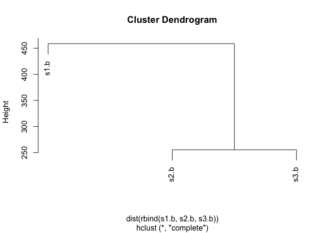
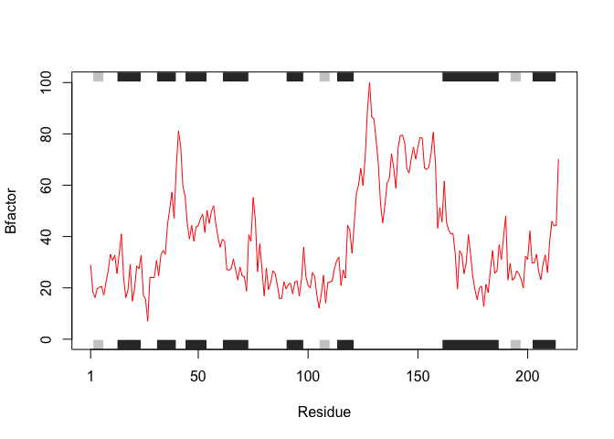

Day 06 Worksheet
================
Tiani Louis
4/19/2019

``` r
library(bio3d)
s1 <- read.pdb("4AKE") # kinase with drug
```

    ##   Note: Accessing on-line PDB file

``` r
s2 <- read.pdb("1AKE") # kinase no drug
```

    ##   Note: Accessing on-line PDB file
    ##    PDB has ALT records, taking A only, rm.alt=TRUE

``` r
s3 <- read.pdb("1E4Y") # kinase with drug
```

    ##   Note: Accessing on-line PDB file

``` r
s1.chainA <- trim.pdb(s1, chain="A", elety="CA")
s2.chainA <- trim.pdb(s2, chain="A", elety="CA")
s3.chainA <- trim.pdb(s3, chain="A", elety="CA")
s1.b <- s1.chainA$atom$b
s2.b <- s2.chainA$atom$b
s3.b <- s3.chainA$atom$b
plotb3(s1.b, sse=s1.chainA, typ="l", ylab="Bfactor")
```


``` r
plotb3(s2.b, sse=s2.chainA, typ="l", ylab="Bfactor")
```


``` r
plotb3(s3.b, sse=s3.chainA, typ="l", ylab="Bfactor")
```


**QUESTIONS:**

**Q1. What type of object is returned from the read.pdb() function?**
---------------------------------------------------------------------

### A1. The read.pdb function reads PDB files and returns a list of elements that describe a given protein, including total number of atoms, sequence, and other attributes.

**Q2. What does the trim.pdb() function do?**
---------------------------------------------

### A2. The trim.pdb function restricts the amount of atoms/chains included, such that we can focus our analysis on the alpha carbons.

note: The "elety"" function includes the atom names.

**Q3. What input parameter would turn off the marginal black and grey rectangles in the plots and what do they represent in this case?**
----------------------------------------------------------------------------------------------------------------------------------------

### A3. The black and grey rectangles denote the secondary structure of the protein at particular residues. Black = a helix; grey = b strands. The parameter that must be turned off to remove these elements "sse".

**Q4. What would be a better plot to compare across the different proteins?**
-----------------------------------------------------------------------------

### A4. A better way to visually compare the different proteins would be to use hierarchical clustering and then plot the resulting clustered data.

**Q5. Which proteins are more similar to each other in their B-factor trends. How could you quantify this? HINT: try the rbind(), dist() and hclust() functions together with a resulting dendrogram plot. Look up the documentation to see what each of these functions does.**
--------------------------------------------------------------------------------------------------------------------------------------------------------------------------------------------------------------------------------------------------------------------------------

### A5. At first glance, the s1.b and s3.b proteins are most similar. However upon further examination, it was determined that this was due to a copy/paste error. Using clustering functions, it was uncovered that s2.b and s3.b are the most similar.

``` r
hc <- hclust(dist(rbind(s1.b, s2.b, s3.b)))
plot(hc)
```



**Q6. How would you generalize the original code above to work with any set of input protein structures?**
----------------------------------------------------------------------------------------------------------

``` r
x <- "4AKE"
protein_drug_int <- function(x) {
  # read in the pdb file 
  s <- read.pdb(x)
  # trim to only include alpha carbons and include atom names (pdb = input)
  s.chainA <- trim.pdb(s, chain="A", elety="CA")
  # select the atom and b-factor (trimmed pdb = input)
  s.b <- s.chainA$atom$b
  #plot the selected data (selections of the trimmed pdb file = input)
  plot.s <- plotb3(s.b, sse=s.chainA, typ="l", ylab="Bfactor", col = "red") 
  return(plot.s)
}

protein_drug_int(x)
```

    ##   Note: Accessing on-line PDB file

    ## Warning in get.pdb(file, path = tempdir(), verbose = FALSE): /var/folders/
    ## 4d/pt89s00968jcbyt2nthjgtyr0000gn/T//RtmpMUhAqV/4AKE.pdb exists. Skipping
    ## download



    ## NULL
